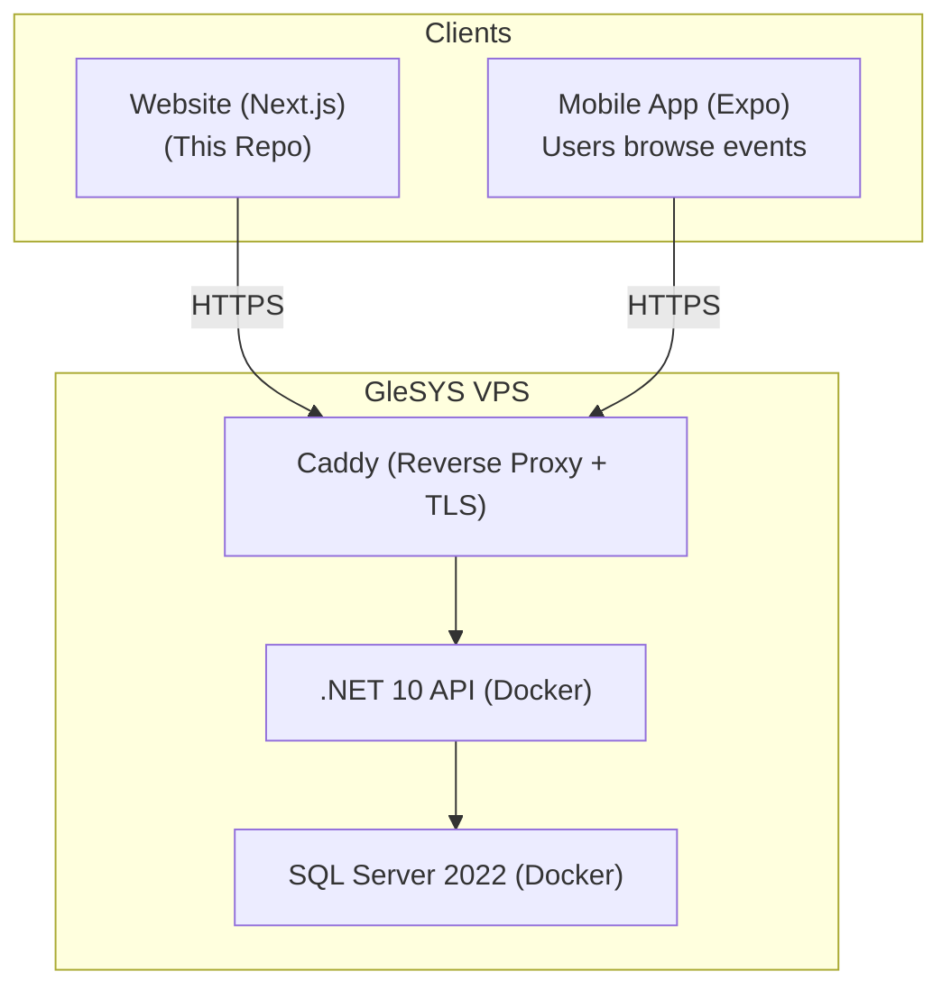
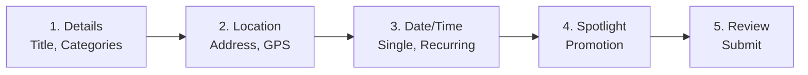
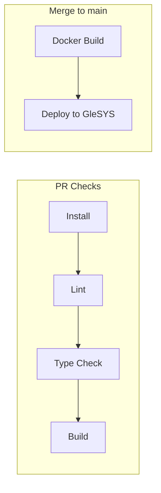

# GODO Frontend (Website)

> Next.js 16 organiser-facing website for the GODO event management platform.

The frontend website is where event organisers create, manage, and promote events. It's part of a 3-repo platform — this website talks to the backend API, which also serves the mobile app.

## Platform Overview



GODO is a **multi-city event management platform** — currently live with Helsingborg as the first integrated city, built to scale across Scandinavia and eventually Europe.

| Repo | Tech | Purpose | URL |
|------|------|---------|-----|
| [**Frontend**](https://github.com/Go-Do-AB/Frontend) | Next.js 16 | Organiser website (this repo) | `godo-dev.nu` |
| [**Backend**](https://github.com/Go-Do-AB/Backend) | .NET 10 | API server | `api.godo-dev.nu` |
| [**MobileApp**](https://github.com/Go-Do-AB/MobileApp) | Expo | User mobile app | App stores (upcoming) |

---

## Quick Start

```bash
# 1. Clone
git clone https://github.com/Go-Do-AB/Frontend.git
cd Frontend

# 2. Install dependencies
npm install

# 3. Configure API URL
echo "NEXT_PUBLIC_API_URL=http://localhost:5198/api" > .env.local

# 4. Run dev server
npm run dev
```

Open [http://localhost:3000](http://localhost:3000). Log in with `martina-godo` / `martina-godo1`.

> **Note:** The [backend API](https://github.com/Go-Do-AB/Backend) must be running for the frontend to work.

---

## Tech Stack

| Technology | Version | Purpose |
|-----------|---------|---------|
| Next.js | 16.1.4 | App Router, SSR, Turbopack |
| React | 19 | UI framework |
| TypeScript | 5.x | Type safety |
| Tailwind CSS | 4.x | Utility-first styling |
| shadcn/ui | - | Pre-built Radix + Tailwind components |
| TanStack Query | 5.x | Server state management |
| React Hook Form | 7.x | Form state management |
| Zod | 4.x | Schema validation |
| Axios | 1.x | HTTP client with JWT interceptor |

---

## Features

### Event Creation (5-Step Form)



- Per-step Zod validation
- Same form for create and edit
- Category/subcategory selection matching backend (8 categories, 24 subcategories)

### Organiser Dashboard
- **My Events** — View, edit, and soft-delete events
- **Quick Create** — Admin-only simplified form for places/attractions

### Authentication
- JWT-based via backend organiser endpoints
- Token stored in `localStorage`, added to requests via Axios interceptor
- Role-based UI (Admin sees Quick Create)

---

## Project Structure

```
src/
├── app/                          # Pages (App Router)
│   ├── (auth)/login/             # Organiser login
│   ├── (auth)/register/          # Organiser registration
│   ├── landing/                  # Main hub after login
│   ├── create-event/             # 5-step event form
│   ├── my-events/                # Organiser dashboard
│   │   └── [id]/edit/            # Edit event
│   ├── quick-create/             # Admin-only quick form
│   └── preview/                  # Mobile app mockup
│
├── components/
│   ├── forms/EventFormStepper.tsx # Multi-step form orchestrator
│   ├── forms/steps/              # 5 step components
│   ├── global/Navbar.tsx         # Navigation bar
│   ├── events/                   # Event display components
│   ├── preview/                  # Mobile app mockup
│   └── ui/                       # shadcn/ui components
│
├── hooks/                        # TanStack Query hooks (CRUD)
├── lib/
│   ├── axios.ts                  # Shared HTTP client + JWT
│   ├── content/contentText.tsx   # Category definitions (must match backend)
│   └── validation/               # Zod schemas + payload transformers
└── types/events.ts               # TypeScript interfaces (matches backend DTOs)
```

---

## API Integration

All API calls use the shared Axios instance with JWT interceptor:

| Method | Endpoint | Purpose |
|--------|----------|---------|
| POST | `/api/organisers/auth/login` | Organiser login |
| POST | `/api/organisers/auth/register` | Organiser registration |
| GET | `/api/events` | List events (with filters) |
| GET | `/api/events/{id}` | Get single event |
| POST | `/api/events` | Create event |
| PUT | `/api/events/{id}` | Full update event |
| PATCH | `/api/events/{id}` | Partial update event |
| DELETE | `/api/events/{id}` | Soft delete event |
| POST | `/api/events/quick` | Quick-create (Admin) |

---

## CI/CD Pipeline



- **PR checks:** `npm ci` → ESLint → TypeScript → `npm run build`
- **Deploy:** Docker multi-stage build, deployed to GleSYS behind Caddy

---

## Development

```bash
npm run dev        # Dev server (Turbopack)
npm run build      # Production build
npm run lint       # ESLint
npm run format     # Prettier
npx tsc --noEmit   # Type check
```

---

## Documentation

### Developer Guides (start here if you're new)

| Guide | Description |
|-------|-------------|
| [Getting Started](forDevelopers/GETTING-STARTED.md) | Clone, install, run |
| [Project Walkthrough](forDevelopers/PROJECT-WALKTHROUGH.md) | Visual codebase tour |
| [Form Guide](forDevelopers/FORM-GUIDE.md) | Multi-step event form deep-dive |
| [Development Workflow](forDevelopers/DEVELOPMENT-WORKFLOW.md) | Branching, linting, PRs |

### Reference Documentation

| Document | Description |
|----------|-------------|
| [Onboarding](docs/ONBOARDING.md) | 15-minute project orientation |
| [Architecture](docs/ARCHITECTURE.md) | System design with diagrams |
| [Docs Hub](docs/README.md) | Documentation index |

### Other Repos

| Repo | Description |
|------|-------------|
| [Backend](https://github.com/Go-Do-AB/Backend) | .NET 10 API |
| [MobileApp](https://github.com/Go-Do-AB/MobileApp) | Expo mobile app |

---

## Contributing

1. Create a feature branch from `main`
2. Make changes
3. Ensure `npm run lint` and `npm run build` pass
4. Submit a pull request

See [Development Workflow](forDevelopers/DEVELOPMENT-WORKFLOW.md) for details.

---

## Environment

| Environment | URL | Purpose |
|-------------|-----|---------|
| Local | `http://localhost:3000` | Development |
| Production | `https://godo-dev.nu` | GleSYS VPS |
| Backend (local) | `http://localhost:5198` | API server |
| Backend (prod) | `https://api.godo-dev.nu` | API server |
