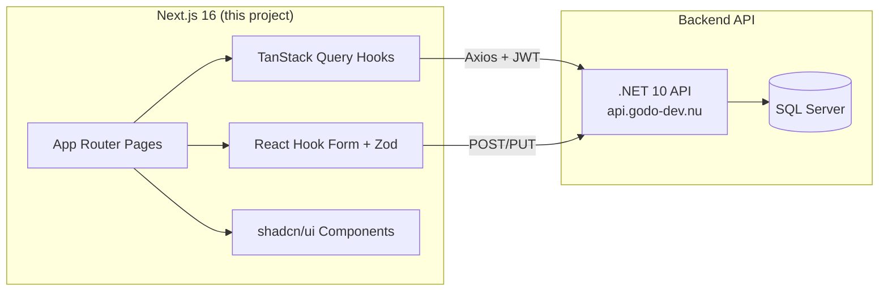
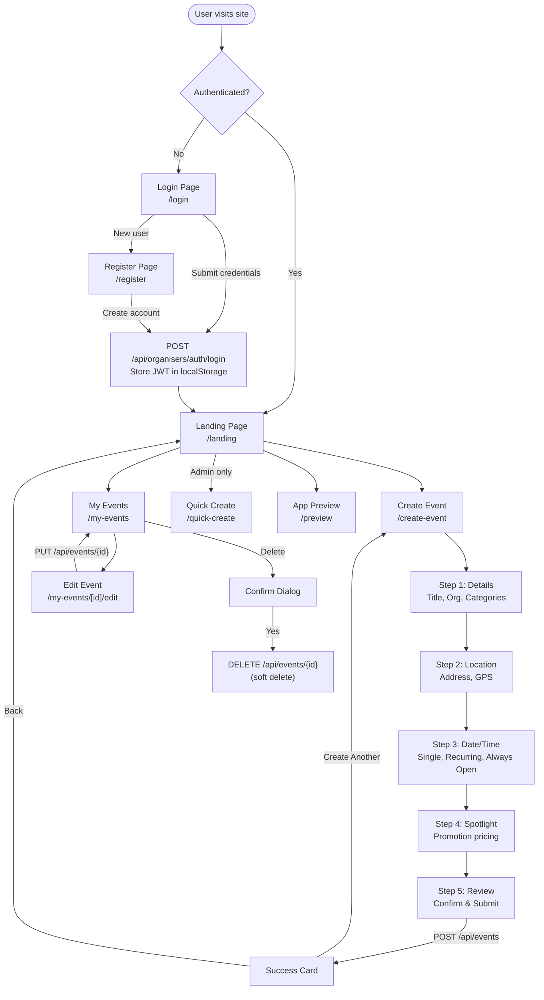
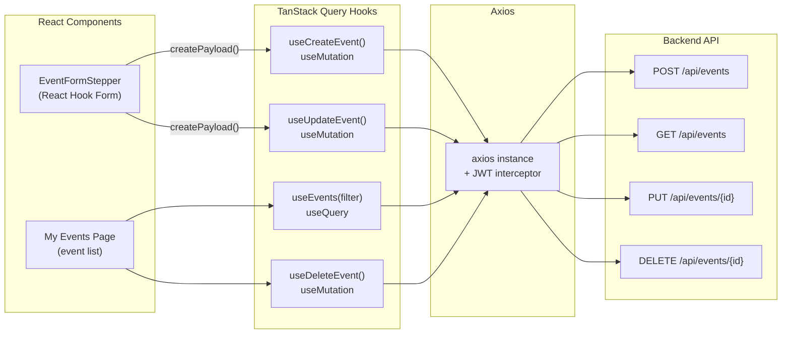
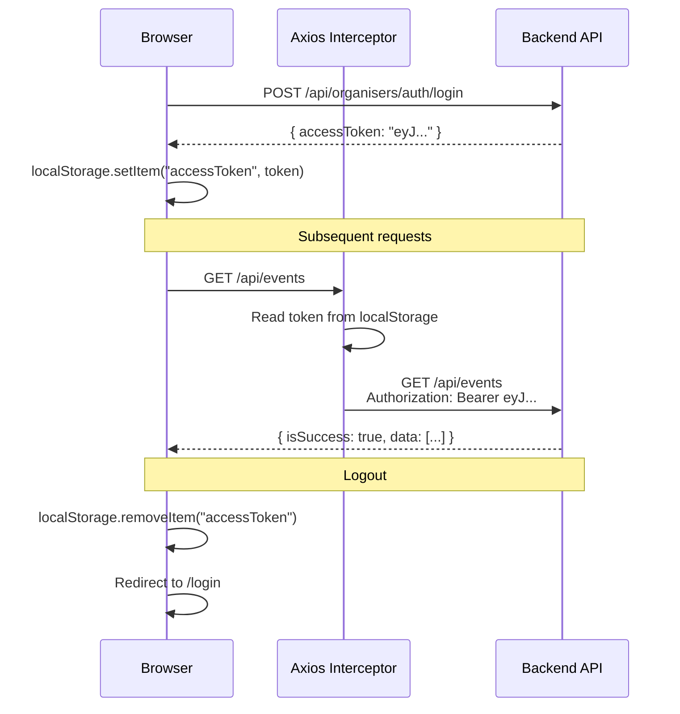
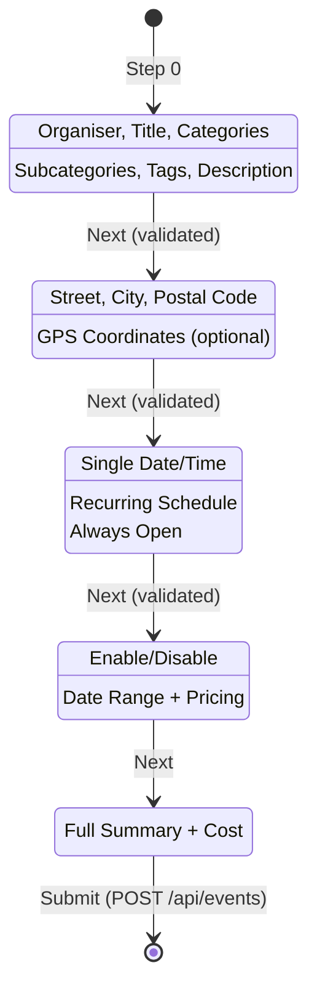
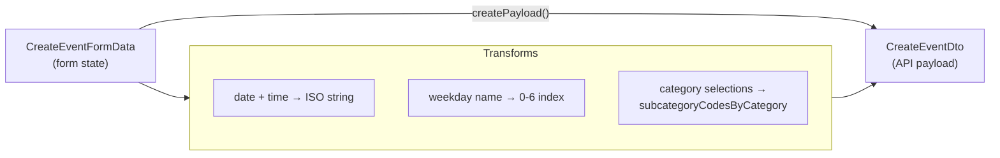
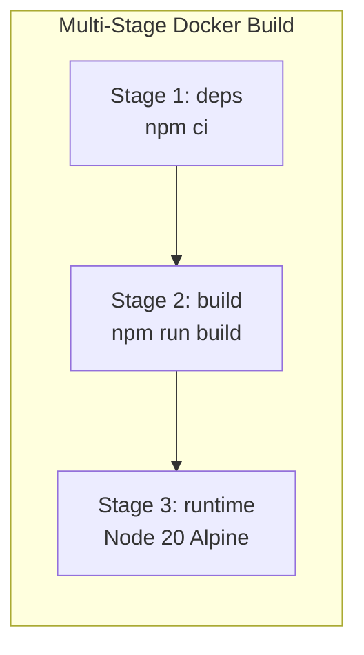

# GODO Frontend (Website) — Architecture Documentation

> Last updated: 2026-02-26

## Overview

The GODO website is a **Next.js 16** application for event organisers to create, manage, and promote events. It connects to the .NET 10 backend API and is part of the broader GODO platform.



---

## Tech Stack

| Technology | Version | Purpose |
|-----------|---------|---------|
| Next.js | 16.1.4 | App Router, SSR, Turbopack |
| React | 19.1.0 | UI framework |
| TypeScript | 5.x | Type safety |
| Tailwind CSS | 4.x | Utility-first styling |
| shadcn/ui | - | Radix + Tailwind components |
| TanStack Query | 5.83.0 | Server state management |
| React Hook Form | 7.60.0 | Form state management |
| Zod | 4.0.5 | Schema validation |
| Axios | 1.10.0 | HTTP client with JWT interceptor |
| date-fns | 4.1.0 | Date formatting |
| Lucide React | 0.525.0 | Icons |
| Sonner | 2.0.6 | Toast notifications |

---

## Project Structure

```
src/
├── app/                          # Next.js App Router
│   ├── layout.tsx                # Root layout (providers, navbar)
│   ├── page.tsx                  # Redirect → /login
│   ├── (auth)/                   # Auth route group
│   │   ├── login/page.tsx        # Organiser login
│   │   ├── register/page.tsx     # Organiser registration
│   │   └── forgot-password/page.tsx
│   ├── landing/page.tsx          # Main landing (role-based UI)
│   ├── create-event/page.tsx     # Multi-step event form
│   ├── my-events/
│   │   ├── page.tsx              # Organiser's events dashboard
│   │   └── [id]/edit/page.tsx    # Event edit page
│   ├── quick-create/page.tsx     # Admin-only quick create
│   └── preview/page.tsx          # Mobile app preview
│
├── components/
│   ├── global/Navbar.tsx         # Header with logo, search, logout
│   ├── forms/
│   │   ├── EventFormStepper.tsx  # Multi-step form orchestrator
│   │   ├── QuickCreateForm.tsx   # Admin quick-create form
│   │   ├── TimePicker.tsx        # Time selector component
│   │   └── steps/
│   │       ├── StepEventDetails.tsx     # Step 1: Title, org, categories
│   │       ├── StepEventLocation.tsx    # Step 2: Address, GPS
│   │       ├── StepEventDateTime.tsx    # Step 3: Date/time/schedule
│   │       ├── StepSpotlight.tsx        # Step 4: Spotlight promotion
│   │       └── StepEventReview.tsx      # Step 5: Review & submit
│   ├── events/EventTicketCard.tsx       # Success card
│   ├── preview/                         # Mobile app mockup
│   └── ui/                              # shadcn/ui components
│
├── hooks/
│   ├── useEvents.ts             # CRUD hooks (list, get, update, delete)
│   ├── useCreateEvent.ts        # Create mutation
│   ├── useQuickCreateEvent.ts   # Quick-create mutation
│   └── useEventForm.ts          # Form + Zod resolver
│
├── lib/
│   ├── axios.ts                 # Axios instance + JWT interceptor
│   ├── utils.ts                 # Helpers (date, org nr validation, cn)
│   ├── content/contentText.tsx  # Category/subcategory/tag definitions
│   └── validation/
│       ├── create-event-schema.ts   # Zod schema + payload creator
│       └── quick-create-schema.ts   # Quick-create schema
│
├── providers/
│   └── react-query-provider.tsx # TanStack Query setup
│
└── types/
    └── events.ts                # TypeScript interfaces (matches backend)
```

---

## User Flow



---

## Data Flow



### JWT Authentication Flow



---

## Multi-Step Event Form



### Form Data Transformation



---

## API Response Format

All API responses use `OperationResult<T>`:

```typescript
// Success
{
  "isSuccess": true,
  "data": { ... },
  "errors": []
}

// Paginated
{
  "isSuccess": true,
  "data": {
    "items": [...],
    "totalCount": 150,
    "pageNumber": 1,
    "pageSize": 30
  },
  "errors": []
}

// Error
{
  "isSuccess": false,
  "data": null,
  "errors": ["Title is required", "City is required"]
}
```

---

## Category System

The frontend has hardcoded category/subcategory/tag definitions that match the backend exactly:

| Code | Category (EN) | Subcategories |
|------|--------------|---------------|
| 1 | Events | 101, 102, 103 |
| 2 | Sports | 201, 202, 203 |
| 3 | Entertainment | 301, 302, 303 |
| 4 | Culture & Sights | 401, 402, 403 |
| 5 | Adventure | 501, 502, 503 |
| 6 | Learn & Explore | 601, 602, 603 |
| 7 | Health & Wellbeing | 701, 702, 703 |

**Tags:** 1001 Free, 1002 Family-friendly, 1003 Indoor, 1004 Outdoor, 1005 Senior, 1006 Wheelchair

---

## Deployment

### Docker (Production)



**Key config:**
- `next.config.ts`: `output: "standalone"` for self-contained builds
- Build arg: `NEXT_PUBLIC_API_URL` (defaults to `http://localhost:5198/api`)
- Runtime port: 3000

### GleSYS Deployment

The frontend runs as a Docker container on the same GleSYS VPS as the backend:

```
Internet → Caddy (auto-TLS) → godo-frontend:3000
         → Caddy (auto-TLS) → godo-api:8080
```

- **Domain:** `godo-dev.nu` → frontend
- **API Domain:** `api.godo-dev.nu` → backend
- **Environment:** `NEXT_PUBLIC_API_URL=https://api.godo-dev.nu/api`

---

## Validation

Swedish organisation number validation uses the **Luhn algorithm**:

```
Input: 556439-3498
1. Strip dash → 5564393498
2. Luhn checksum on 10 digits
3. Valid if checksum mod 10 === 0
```

Form validation runs per-step (you can't proceed without passing the current step's rules).
