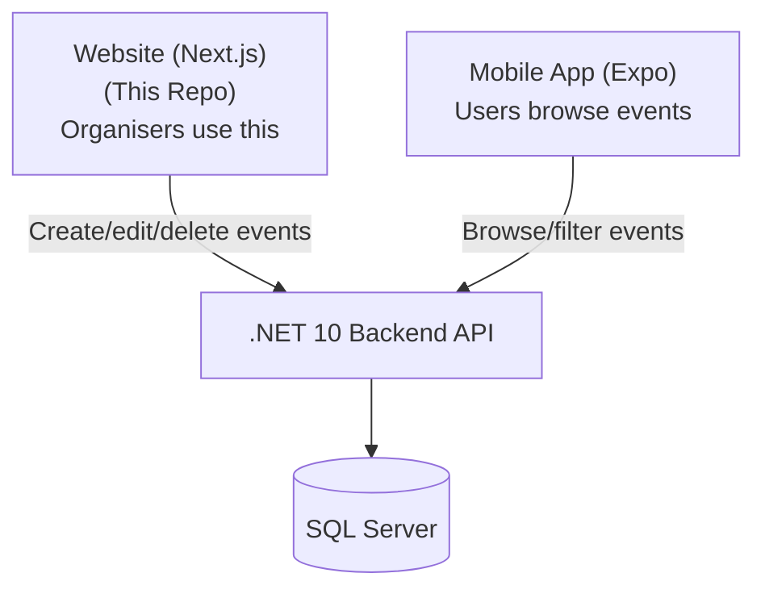
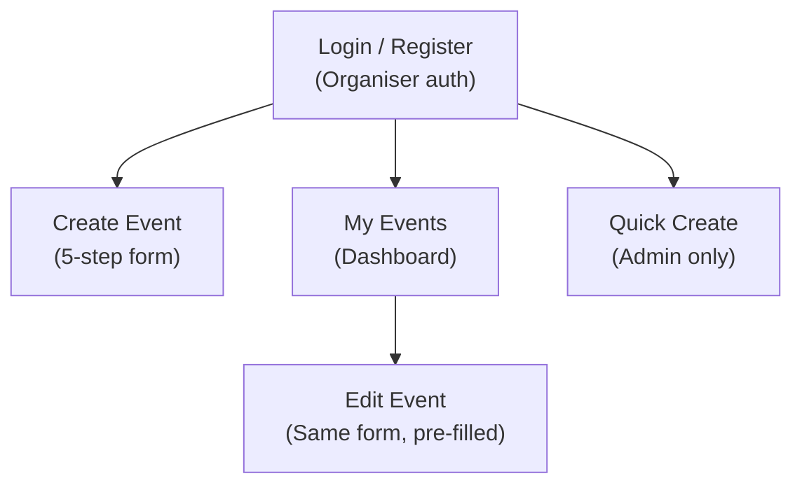

# Onboarding

> Get oriented with the GODO Frontend in 15 minutes. No setup required — just read.

## What is GODO?

GODO is a **multi-city event management platform** that helps people discover things to do. Currently live with Helsingborg as the first integrated city, the platform is built to scale across Scandinavia and eventually Europe.

This repo is the **organiser-facing website** — where event organisers create, manage, and promote their events.



## What Does the Frontend Do?

The website has 5 main functions:



1. **Login/Register** — Organisers authenticate with JWT tokens
2. **Create Event** — A 5-step form: Details → Location → Date/Time → Spotlight → Review
3. **My Events** — Dashboard showing the organiser's events, with edit and delete
4. **Edit Event** — Same form as create, pre-filled with existing data
5. **Quick Create** — Simplified form for admins to quickly add places/attractions

## Tech Stack at a Glance

| Technology | Purpose |
|-----------|---------|
| Next.js 16 | App Router, pages, server-side rendering |
| React 19 | UI components |
| TypeScript | Type safety |
| Tailwind CSS | Styling |
| shadcn/ui | Pre-built UI components |
| TanStack Query | API data fetching and caching |
| React Hook Form + Zod | Form state + validation |
| Axios | HTTP client with JWT interceptor |

## Folder Structure at a Glance

```
src/
├── app/              → Pages (login, landing, create-event, my-events, etc.)
├── components/       → React components (forms, UI, navbar, preview)
├── hooks/            → Data fetching hooks (useEvents, useCreateEvent, etc.)
├── lib/              → Utilities, Axios config, validation schemas, category data
├── providers/        → React Query provider
└── types/            → TypeScript interfaces (must match backend DTOs)
```

## 5 Most Important Files

| # | File | What It Does |
|---|------|-------------|
| 1 | `src/lib/axios.ts` | Shared HTTP client — adds JWT token to all requests |
| 2 | `src/components/forms/EventFormStepper.tsx` | The 5-step form orchestrator — most complex component |
| 3 | `src/lib/validation/create-event-schema.ts` | Zod schema + transforms form data to API format |
| 4 | `src/hooks/useEvents.ts` | All CRUD hooks — how data is fetched and mutated |
| 5 | `src/lib/content/contentText.tsx` | Category/subcategory/tag definitions (must match backend) |

## Key Concepts

### API Communication
- All API calls go through a shared Axios instance (`src/lib/axios.ts`)
- JWT token is stored in `localStorage` and automatically added to every request
- All responses use `OperationResult<T>` format: `{ isSuccess, data, errors }`

### The Event Form
- 5 steps with per-step validation (can't skip ahead)
- Zod schema validates, `createPayload()` transforms to API format
- Same form is used for both create and edit (edit pre-fills via `eventDtoToFormData()`)

### Categories Must Match Backend
- Category/subcategory/tag definitions are hardcoded in `contentText.tsx`
- These **must exactly match** the backend's DataSeeder
- Subcategory codes follow the pattern: `categoryCode * 100 + index`

### Authentication
- Organisers log in via `POST /api/organisers/auth/login`
- JWT stored in `localStorage` as `accessToken`
- Axios interceptor adds `Authorization: Bearer <token>` to all requests
- Admin role decoded from JWT for admin-only features (Quick Create)

## Common Mistakes to Avoid

| Mistake | Why It's Wrong | Do This Instead |
|---------|---------------|-----------------|
| Use raw `fetch()` | Bypasses JWT interceptor | Use the shared `api` from `lib/axios.ts` |
| Hardcode API URLs | Breaks in production | Use `NEXT_PUBLIC_API_URL` env var |
| Forget to update `contentText.tsx` | Categories won't match backend | Keep in sync with backend DataSeeder |
| Skip Zod validation | Form can submit invalid data | Always validate through schema |
| Store sensitive data in `localStorage` | Security risk | Only store JWT tokens |

## What's Next

1. **[forDevelopers/Getting Started](../forDevelopers/GETTING-STARTED.md)** — Clone, install, and run
2. **[forDevelopers/Project Walkthrough](../forDevelopers/PROJECT-WALKTHROUGH.md)** — Visual tour of the codebase
3. **[forDevelopers/Form Guide](../forDevelopers/FORM-GUIDE.md)** — How the event form works
4. **[ARCHITECTURE.md](ARCHITECTURE.md)** — Full architecture with diagrams
