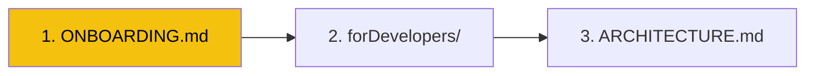

# Documentation Hub

> All documentation for the GODO Frontend (Website).

## Quick Reference

| Document | What It Covers |
|----------|----------------|
| [ARCHITECTURE.md](ARCHITECTURE.md) | System design — tech stack, data flow, deployment, form architecture |
| [ONBOARDING.md](ONBOARDING.md) | 15-minute orientation for new team members |
| [CI/CD & Deployment](https://github.com/Go-Do-AB/Backend/blob/main/docs/CI-CD-DEPLOYMENT.md) | Visual CI/CD pipeline & deploy flow (both BE + FE) — lives in Backend repo |

## Developer Guides

Hands-on tutorials and walkthroughs live in [`forDevelopers/`](../forDevelopers/README.md):

| Guide | Purpose |
|-------|---------|
| [Getting Started](../forDevelopers/GETTING-STARTED.md) | Zero to running dev server |
| [Project Walkthrough](../forDevelopers/PROJECT-WALKTHROUGH.md) | Visual codebase tour |
| [Form Guide](../forDevelopers/FORM-GUIDE.md) | Multi-step event form deep-dive |
| [Development Workflow](../forDevelopers/DEVELOPMENT-WORKFLOW.md) | Branching, linting, CI/CD |

## Reading Order

### New Developer

### Day-to-Day Development
- [ARCHITECTURE.md](ARCHITECTURE.md) — How things are structured
- [forDevelopers/Form Guide](../forDevelopers/FORM-GUIDE.md) — The event form
- [Backend API docs](https://github.com/Go-Do-AB/Backend/blob/main/docs/API.md) — API reference

## Cross-Repo Documentation

| Repo | Purpose | Docs |
|------|---------|------|
| **[Backend](https://github.com/Go-Do-AB/Backend)** | .NET 10 API | `docs/` and `forDevelopers/` |
| **[Frontend](https://github.com/Go-Do-AB/Frontend)** | Next.js website (this repo) | You are here |
| **[MobileApp](https://github.com/Go-Do-AB/MobileApp)** | Expo mobile app | `docs/` and `forDevelopers/` |
