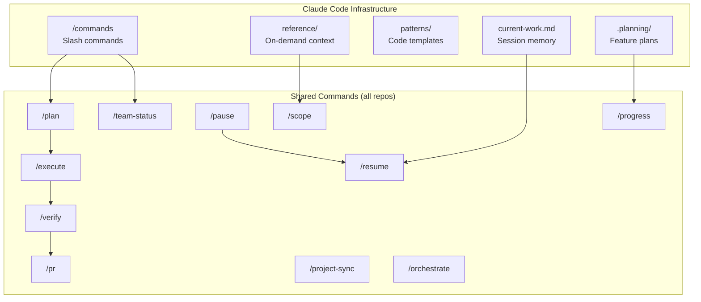
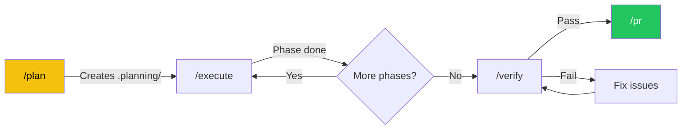

# Claude Code Architecture Guide

> How we use Claude Code across the GODO platform — commands, planning, orchestration, and workflows.

## Overview

Every GODO repo (Backend, Frontend, MobileApp) shares the same Claude Code infrastructure. This gives us:

- **Consistent workflows** across all repos
- **Cross-repo orchestration** from any repo
- **Planning lifecycle** for features that span multiple sessions
- **Team visibility** through GitHub Project Board integration
- **Context management** so Claude never loses track



## Directory Structure

```
.claude/
├── commands/                  # Slash commands (15 shared + repo-specific)
│   ├── plan.md               # /plan — Create feature plan with phases
│   ├── execute.md            # /execute — Run current phase
│   ├── progress.md           # /progress — Show state + next action
│   ├── verify.md             # /verify — Test, lint, type check
│   ├── pause.md              # /pause — Save state for next session
│   ├── resume.md             # /resume — Quick briefing + continue
│   ├── pr.md                 # /pr — Create PR with conventions
│   ├── review.md             # /review — Review changes before commit
│   ├── status.md             # /status — Quick overview
│   ├── scope.md              # /scope <area> — Load reference files
│   ├── team-status.md        # /team-status — Team dashboard
│   ├── project-sync.md       # /project-sync — Sync project board
│   ├── cross-repo.md         # /cross-repo — Check consistency
│   ├── orchestrate.md        # /orchestrate — Cross-repo work
│   └── security.md           # /security — Security audit
├── reference/                 # Detailed context (loaded on demand)
│   ├── categories.md         # (BE) Category/subcategory tables
│   ├── endpoints.md          # (BE) API endpoint reference
│   ├── form-architecture.md  # (FE) Multi-step form details
│   ├── components-inventory.md # (APP) Component audit
│   └── ...                   # More per-repo reference files
├── patterns/                  # Code scaffolding templates
│   ├── command-template.md   # (BE) New CQRS command
│   ├── page-template.md      # (FE) New Next.js page
│   ├── screen-template.md    # (APP) New Expo screen
│   └── ...
├── templates/planning/        # Planning lifecycle templates
│   ├── STATE.md              # Feature plan state file
│   ├── PHASE.md              # Per-phase detail template
│   └── SUMMARY.md            # Completion summary template
├── current-work.md           # Session persistence (auto-updated)
├── settings.json             # Hooks configuration
└── settings.local.json       # Tool permissions
```

---

## The Planning Lifecycle

For any feature larger than a quick fix, use the planning commands:



### Step 1: Plan — Define What You're Building

```
/plan add city-based event filtering
```

**What happens:**
1. Claude reads `CLAUDE.md` and `.claude/current-work.md` for context
2. Investigates the codebase — finds relevant files, existing patterns, affected modules
3. Presents requirements for your approval
4. Breaks work into phases (each completable in one session)
5. Saves everything to `.planning/STATE.md`
6. Checks for related GitHub issues

**Example output:**

```markdown
## Requirements: City-Based Event Filtering

**Goal**: Allow filtering events by city name in the aggregated endpoint
**Affected repos**: Backend, MobileApp
**Key changes**:
- [ ] Add city field to EventFilterDto
- [ ] Add city filter to aggregated query
- [ ] Update MobileApp filter context

Please confirm or adjust these requirements.

## Roadmap

### Phase 1: Backend Filter — small
- [ ] Add `City` property to EventFilterDto
- [ ] Update GetAggregatedEventsQueryHandler to filter by city
- [ ] Add unit tests for city filtering

### Phase 2: MobileApp Integration — small
- [ ] Add city picker to filter sheet
- [ ] Pass city parameter in useEvents hook
- [ ] Test end-to-end

Saved to .planning/STATE.md
Run `/execute` to start Phase 1, or `/progress` to review the plan.
```

### Step 2: Execute — Build Phase by Phase

```
/execute
```

**What happens:**
1. Reads `.planning/STATE.md` to find the current phase
2. Loads relevant patterns from `.claude/patterns/`
3. Works through each task in order
4. After completing each task, checks it off in STATE.md
5. When the phase is done, updates the progress bar and moves to next phase

**Example — during execution you'll see:**

```
Starting Phase 1: Backend Filter (Tasks: 0/3)

Task 1: Add City property to EventFilterDto
  → Editing Application/Events/Dtos/EventDtos.cs
  → Added: public string? City { get; set; }
  ✓ Task 1 complete

Task 2: Update GetAggregatedEventsQueryHandler
  → Reading existing handler...
  → Adding city filter with case-insensitive comparison
  ✓ Task 2 complete

Task 3: Add unit tests
  → Creating test method FilterByCity_ReturnsMatchingEvents
  → Running: dotnet test --filter "City"
  → 3 tests passed
  ✓ Task 3 complete

Phase 1 complete! [██████████░░░░░░░░░░] 1/2 phases
Run `/execute` to start Phase 2, or `/verify` to check Phase 1.
```

### Step 3: Verify — Run All Checks

```
/verify
```

**What happens (varies by repo):**

| Repo | Checks Run |
|------|-----------|
| Backend | `dotnet build` → `dotnet test` → `dotnet format --verify-no-changes` |
| Frontend | `npm run lint` → `npx tsc --noEmit` → `npm run build` |
| MobileApp | `npm test` → `npx tsc --noEmit` |

Plus: reviews all changed files for quality, security issues, and cross-repo consistency.

**Example output:**

```
## Verification Report

### Build & Test
- [x] dotnet build — Success (0 warnings)
- [x] dotnet test — 253/253 passed (3 new)
- [x] dotnet format — No issues

### Code Review
- [x] No security concerns
- [x] Follows CQRS pattern
- [x] OperationResult<T> used correctly

### Cross-Repo Impact
- [!] MobileApp needs updated types for new City filter parameter
  → Suggest running /orchestrate to sync

All checks passed. Run /pr to create a pull request.
```

### Step 4: PR — Create a Pull Request

```
/pr
```

Creates a PR following GODO conventions:

```markdown
## Summary
- Add city-based filtering to aggregated events endpoint
- Events can now be filtered by city name (case-insensitive)

## Changes
- `EventFilterDto` — added `City` property
- `GetAggregatedEventsQueryHandler` — added city filter logic
- 3 new unit tests for city filtering

## Test Plan
- [x] Unit tests pass (253/253)
- [x] Build passes
- [ ] Manual test: GET /api/events/aggregated?city=Helsingborg

## Cross-Repo Impact
- MobileApp needs filter context update (tracked in Phase 2)
```

After PR creation, Claude checks the GitHub Project Board and offers to update issue statuses.

### Between Sessions — Pause, Resume, Progress

**Ending a session:**
```
/pause
```
Saves detailed state to both `.planning/STATE.md` and `.claude/current-work.md`. Reports any uncommitted changes.

**Starting a new session:**
```
/resume
```
Reads saved state silently, shows git status, and briefs you:

```
Resuming: City-Based Event Filtering
Phase 1 of 2 complete. Phase 2 (MobileApp Integration) ready to execute.
3 files changed, no uncommitted work.
Run /execute to start Phase 2.
```

**Checking status anytime:**
```
/progress
```
Shows a dashboard:

```
## City-Based Event Filtering

[██████████░░░░░░░░░░] 1/2 phases

### Phase 1: Backend Filter — COMPLETE
- [x] Add City to EventFilterDto
- [x] Update query handler
- [x] Add unit tests

### Phase 2: MobileApp Integration — PENDING
- [ ] Add city picker to filter sheet
- [ ] Pass city parameter in useEvents hook
- [ ] Test end-to-end

Next action: /execute to start Phase 2
```

---

## The `.planning/` Directory

When you run `/plan`, a `.planning/` directory is created in the repo root:

```
.planning/
└── STATE.md    # Living memory — updated by every /execute
```

**STATE.md** during active work looks like this:

```markdown
# Feature: City-Based Event Filtering

> Created: 2026-03-07
> Status: Phase 1 complete — ready to execute Phase 2

## Goal
Allow filtering events by city name in the aggregated endpoint.

## Roadmap

### Phase 1: Backend Filter — small
- [x] Add City property to EventFilterDto
- [x] Update GetAggregatedEventsQueryHandler
- [x] Add unit tests

### Phase 2: MobileApp Integration — small
- [ ] Add city picker to filter sheet
- [ ] Pass city parameter in useEvents hook
- [ ] Test end-to-end

## Current Position
Phase: 2 of 2
Task:  0 of 3
Status: Ready to execute

## Progress
[██████████░░░░░░░░░░] 1/2 phases

## Decisions
| Date | Decision | Rationale |
|------|----------|-----------|
| 2026-03-07 | Case-insensitive city match | Users shouldn't need exact casing |

## Cross-Repo Actions
- MobileApp: Update FilterState to include city field
```

**Important**: `.planning/` is for active work only. Delete it after the feature is merged, or keep it for reference.

---

## Context Management

### The Problem

Claude Code has a finite context window. Loading everything at startup wastes it on information you may not need.

### The Solution: Two-Tier Context

```
Tier 1 (Always loaded)          Tier 2 (On demand)
┌─────────────────────┐         ┌──────────────────────────┐
│ CLAUDE.md (~200 ln) │         │ .claude/reference/       │
│                     │         │                          │
│ - Platform identity │         │ - categories.md          │
│ - Session rules     │  /scope │ - endpoints.md           │
│ - Key patterns      │ ──────> │ - testing.md             │
│ - Conventions       │         │ - form-architecture.md   │
│ - Command reference │         │ - components-inventory.md│
└─────────────────────┘         └──────────────────────────┘
```

### Using `/scope`

Load reference files when you need them:

```
/scope api          # Load API endpoints reference
/scope categories   # Load category/subcategory tables
/scope tests        # Load test infrastructure
/scope form         # Load form architecture (FE)
/scope components   # Load component inventory (APP)
/scope all          # Load everything (use sparingly!)
```

**Example**: You're about to work on event categories. Instead of having all 2000+ lines of reference loaded from the start, you run `/scope categories` and Claude loads just the category tables into context.

### Context Tracking

Every response ends with a context indicator showing how much of the conversation window is used:

```
Context: ~15% used                    ← Green — plenty of room
Context: ~55% used                    ← Orange — start wrapping up or use /pause
Context: ~75% used                    ← Red — use /compact or /pause soon
```

**What to do when context gets high:**
- Run `/pause` to save state, then start a new session with `/resume`
- Use `/compact` (built-in Claude Code command) to compress the conversation
- Avoid `/scope all` — load only what you need

---

## Cross-Repo Orchestration

### When to Use `/orchestrate`

Any task that touches multiple repos:
- Adding a new API endpoint (BE) + consuming it (FE/APP)
- Changing a DTO (BE) + updating types (FE/APP)
- Adding a new category (BE seeder + FE content + APP constants)

```
/orchestrate add "wheelchair accessible" tag to all repos
```

### How It Works

1. Analyzes which repos are affected
2. Plans the order (usually Backend first — APIs before consumers)
3. Uses the Agent tool to delegate to each repo directory
4. Runs `/cross-repo` to verify consistency

**Example walkthrough:**

```
You: /orchestrate add new subcategory "Water sports" under Sports

Claude:
Analyzing cross-repo impact...

## Orchestration Plan

### Step 1: Backend (source of truth)
- Add subcategory to DataSeeder.cs (code: 204, categoryCode: 2)
- Add migration for new seed data
- Update category docs

### Step 2: Frontend
- Add "Water sports" to contentText.tsx category mappings
- Add Swedish translation "Vattensport"

### Step 3: MobileApp
- Update types/api.ts subcategory constants
- Add to filter options

### Step 4: Verify
- Run /cross-repo to confirm alignment

Proceeding with Step 1 (Backend)...
```

### Checking Consistency

```
/cross-repo
```

Compares categories, types, and endpoints across all 3 repos and flags mismatches:

```
## Cross-Repo Consistency Check

### Categories
- [x] Backend DataSeeder: 8 categories, 24 subcategories
- [x] Frontend contentText: 8 categories, 24 subcategories
- [!] MobileApp constants: 8 categories, 23 subcategories
  → Missing: 204 "Water sports" — needs sync

### Endpoints
- [x] All Frontend API calls match Backend routes
- [x] All MobileApp API calls match Backend routes

1 issue found. Run /orchestrate to fix.
```

---

## Team & Project Board

### `/team-status` — Who's Doing What

```
/team-status
```

Shows a team dashboard by querying GitHub across all 3 repos:

```
## Team Dashboard — 2026-03-07

### Nemanja1208
- PR #67 (Backend) — "Add city filtering" — In Review
- PR #45 (Frontend) — "Update form validation" — Merged today
- Branch: feature/city-filter (MobileApp) — 3 commits ahead

### KristinaK993
- Issue #42 — "Improve event cards" — In Progress
- PR #12 (MobileApp) — "Event card redesign" — Draft
- No blockers

### Items needing attention
- PR #67 has been in review for 2 days — needs reviewer
- Issue #38 is "Ready for Sprint" with no assignee
```

### `/project-sync` — Keep Board Updated

```
/project-sync
```

Finds mismatches between PR/issue status and the project board:

```
## Project Board Sync

### Mismatches Found
1. PR #45 (Frontend) merged → Issue #40 still "In Progress"
   → Move to "Done"? [Y/n]

2. PR #67 (Backend) opened → Issue #42 still "Ready for Sprint"
   → Move to "In Review"? [Y/n]

### Already in sync
- 12 items correctly positioned
```

---

## Session Persistence

### How It Works

1. **Session start**: Claude reads `.claude/current-work.md` silently. If there's unfinished work, it mentions it briefly.
2. **On commit/push**: `current-work.md` is updated with what was done, what's next, and decisions made.
3. **Between sessions**: The file bridges the gap — next session picks up where you left off.

### `/pause` and `/resume` for Planned Work

**`/pause`** saves detailed state:
```
Saved to .claude/current-work.md:
  - Working on: City-Based Event Filtering
  - Phase 1 complete, Phase 2 pending
  - 3 files modified, all committed

Saved to .planning/STATE.md:
  - Updated progress bar and session log

You have 0 uncommitted changes. Safe to close.
```

**`/resume`** picks up cleanly:
```
Resuming from saved state...

Current work: City-Based Event Filtering
Phase: 2 of 2 (MobileApp Integration)
Git: main branch, clean working tree
Last session: Completed Phase 1 (Backend Filter)

Run /execute to start Phase 2.
```

---

## Hooks — Automatic Reminders

The `.claude/settings.json` file configures hooks that fire automatically:

### Post-Edit Hook
When you edit a source file, Claude reminds you to format before commit:

```
[hook] .cs file modified: Application/Events/Dtos/EventDtos.cs — run dotnet format before commit
```

(Frontend/MobileApp: triggers on `.ts/.tsx` files with `npm test` reminder)

### Active Plan Hook
When you type any message while `.planning/STATE.md` exists:

```
[context] Active plan detected — read .planning/STATE.md for current state
```

This ensures Claude never forgets about your in-progress feature plan.

---

## Real-World Workflow Examples

### Example 1: Quick Bug Fix (No Planning Needed)

```
You: The aggregated endpoint returns 500 when city parameter has special characters

Claude: Let me investigate...
  → Reads the query handler
  → Finds the issue: unescaped LIKE query
  → Fixes with parameterized query
  → Runs dotnet test — all pass

You: commit and push

Claude: Creates commit, pushes to feature branch

You: /pr

Claude: Creates PR with fix description
```

### Example 2: Multi-Session Feature

**Session 1:**
```
You: /plan add event spotlight feature with admin management

Claude: [investigates codebase, creates plan with 3 phases]
  Phase 1: Domain model + migration
  Phase 2: API endpoints (CQRS)
  Phase 3: Admin management UI

You: /execute
Claude: [completes Phase 1 — entity, migration, repository updates]

You: /pause
Claude: [saves state to current-work.md and STATE.md]
```

**Session 2 (next day):**
```
Claude: [reads current-work.md silently]
  "Resuming: Event Spotlight Feature — Phase 1 complete, Phase 2 ready"

You: /execute
Claude: [completes Phase 2 — command, query, controller, tests]

You: /execute
Claude: [completes Phase 3 — admin endpoints]

You: /verify
Claude: [runs build, 256 tests pass, format clean]

You: /pr
Claude: [creates PR, updates project board]
```

### Example 3: Cross-Repo Feature

```
You: /orchestrate add "Seniors" age filter tag to all repos

Claude: [analyzes impact]
  Backend: Add tag code 1007 to DataSeeder + migration
  Frontend: Add tag to filter options in contentText.tsx
  MobileApp: Add tag to FilterContext + filter sheet UI

  Starting with Backend...
  [creates migration, updates seeder, runs tests]

  Moving to Frontend...
  [uses Agent tool to edit FE repo files]

  Moving to MobileApp...
  [uses Agent tool to edit APP repo files]

  Running /cross-repo...
  All 3 repos aligned. 7 tags consistent across platform.
```

---

## Security

### `/security` — Audit Your Repo

```
/security
```

Runs a repo-appropriate security scan:

| Repo | Checks |
|------|--------|
| Backend | `dotnet list package --vulnerable` + secret scan |
| Frontend | `npm audit` + secret scan |
| MobileApp | `npm audit` + secret scan |

### Built-in Rules

CLAUDE.md enforces security practices that Claude follows automatically:
- Never hardcode secrets (JWT keys, API keys, connection strings)
- Use environment variables or user secrets
- Flag security concerns immediately when reviewing code
- Check for OWASP top 10 vulnerabilities in generated code

---

## Quick Reference

### Planning Lifecycle
| Command | What It Does |
|---------|-------------|
| `/plan <feature>` | Create feature plan with phases and roadmap |
| `/execute` | Execute current phase from .planning/STATE.md |
| `/progress` | Show project state + route to next action |
| `/verify` | Run all checks (build, test, lint, types) |
| `/pause` | Save state for session continuity |
| `/resume` | Resume from saved state with briefing |

### Team & Project
| Command | What It Does |
|---------|-------------|
| `/team-status` | Team dashboard — PRs, branches, project board |
| `/project-sync` | Sync PR status with GitHub Project Board |
| `/pr` | Create PR with GODO conventions |
| `/review` | Review changes before commit |

### Utilities
| Command | What It Does |
|---------|-------------|
| `/status` | Quick overview — current work + git |
| `/scope <area>` | Load reference files on demand |
| `/cross-repo` | Check consistency across repos |
| `/orchestrate <task>` | Delegate work across repos |
| `/security` | Run security audit |

### Repo-Specific
| Command | Repo | What It Does |
|---------|------|-------------|
| `/test [filter]` | Backend | Run tests with smart filtering |
| `/sync-check` | Backend | Check external event sync status |
| `/build-check` | Frontend | Quick lint + type check + build |
| `/i18n-check` | MobileApp | Scan for missing translations |
| `/size-check` | MobileApp | Find components over 150 lines |

## Commit Conventions

All commits follow the format:
```
<type>: <description>

Co-Authored-By: Claude Opus 4.6 <noreply@anthropic.com>
```

Types: `feat`, `fix`, `refactor`, `docs`, `test`, `chore`, `style`
