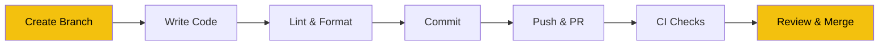
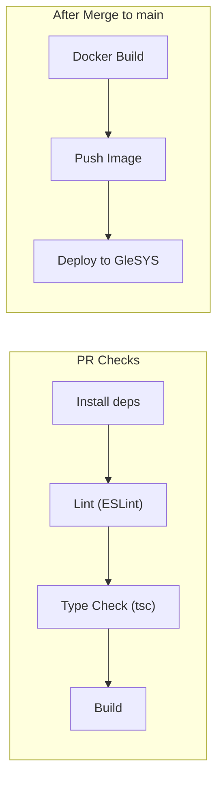

# Development Workflow

> Day-to-day practices: branching, linting, CI/CD, and submitting PRs.

## Development Cycle



---

## Branch Strategy

| Branch | Purpose | Example |
|--------|---------|---------|
| `main` | Production-ready code | Always deployable |
| `feature/*` | New features | `feature/add-search` |
| `fix/*` | Bug fixes | `fix/date-picker-bug` |
| `chore/*` | Maintenance, deps, docs | `chore/update-deps` |

**Rules:**
- Never push directly to `main`
- All changes go through pull requests
- Branch from `main`, merge back to `main`

---

## Available Scripts

```bash
npm run dev        # Start dev server (Turbopack)
npm run build      # Production build
npm run start      # Start production server
npm run lint       # ESLint check
npm run format     # Prettier format all files
```

---

## Making Changes

### Adding a New Page

1. Create `src/app/your-page/page.tsx`
2. Next.js automatically routes to `/your-page`
3. Add navigation link in `Navbar.tsx` if needed

### Adding a New Component

1. Create in the appropriate subfolder:
   - `components/forms/` — form-related
   - `components/events/` — event display
   - `components/global/` — site-wide (navbar, footer)
   - `components/ui/` — shadcn/ui primitives only
2. Use TypeScript interfaces for props
3. Import and use in your page

### Adding a New API Hook

1. Create or update a hook in `src/hooks/`
2. Use TanStack Query's `useQuery` (reads) or `useMutation` (writes)
3. Use the shared `api` instance from `src/lib/axios.ts`
4. Type the response with interfaces from `src/types/events.ts`

### Modifying the Event Form

See the [Form Guide](FORM-GUIDE.md) for the full walkthrough. Quick summary:
1. Update Zod schema in `lib/validation/create-event-schema.ts`
2. Update the relevant Step component
3. Update `createPayload()` and `eventDtoToFormData()`

---

## Code Conventions

### Naming

| Element | Convention | Example |
|---------|-----------|---------|
| Components | PascalCase | `EventFormStepper.tsx` |
| Hooks | camelCase with `use` prefix | `useEvents.ts` |
| Utilities | camelCase | `formatDate()` |
| Types/Interfaces | PascalCase | `CreateEventDto` |
| Pages | `page.tsx` in route folder | `src/app/landing/page.tsx` |

### Styling

- Use **Tailwind CSS** utility classes
- Use **shadcn/ui** components for common UI elements (Button, Card, Dialog, etc.)
- Use `cn()` from `lib/utils.ts` to merge class names conditionally

### API Calls

- Always use the shared `api` instance from `lib/axios.ts`
- Never use raw `fetch()` with hardcoded URLs
- All responses follow `OperationResult<T>` format

### Categories Must Match Backend

The category/subcategory/tag definitions in `src/lib/content/contentText.tsx` **must match the backend DataSeeder exactly**. If the backend adds a category, the frontend must be updated too.

---

## CI/CD Pipeline

Every pull request triggers GitHub Actions:



### PR Check Pipeline (`pull-request-check-action.yml`)

| Step | Command | Blocks Merge? |
|------|---------|---------------|
| Install | `npm ci` | Yes |
| Lint | `npm run lint` | Yes |
| Type Check | `npx tsc --noEmit` | Yes |
| Build | `npm run build` | Yes |

### Deploy Pipeline (`deploy.yml`)

After merge to `main`:
1. Multi-stage Docker build (Node 20 Alpine)
2. Push to container registry
3. Deploy to GleSYS VPS behind Caddy reverse proxy
4. Available at `https://godo-dev.nu`

---

## PR Checklist

Before submitting a PR, verify:

- [ ] `npm run lint` passes
- [ ] `npx tsc --noEmit` passes (no type errors)
- [ ] `npm run build` succeeds
- [ ] Tested in browser with backend running
- [ ] No hardcoded API URLs (use `NEXT_PUBLIC_API_URL`)
- [ ] New components use TypeScript props interfaces
- [ ] Category changes match backend (if applicable)

---

## Debugging Tips

### API Call Issues

Open browser DevTools → Network tab to see:
- Request URL (verify `NEXT_PUBLIC_API_URL` is correct)
- Request headers (verify JWT `Authorization` header is present)
- Response body (check `isSuccess` and `errors` fields)

### Form Debugging

React Hook Form has a devtools extension. You can also log form state:
```typescript
const form = useFormContext();
console.log(form.getValues());      // Current form data
console.log(form.formState.errors); // Validation errors
```

### Common Issues

| Issue | Where to Look |
|-------|---------------|
| Login doesn't work | Check `NEXT_PUBLIC_API_URL` in `.env.local` |
| Form won't submit | Check Zod validation in `create-event-schema.ts` |
| Categories missing | Compare `contentText.tsx` with backend DataSeeder |
| JWT expired | Login again — tokens expire in 5 minutes |
| Edit form empty | Check `eventDtoToFormData()` transformation |

---

## Related Documentation

- **[Form Guide](FORM-GUIDE.md)** — Multi-step form deep-dive
- **[docs/ARCHITECTURE.md](../docs/ARCHITECTURE.md)** — Full architecture with diagrams
- **[Backend API docs](https://github.com/Go-Do-AB/Backend/blob/main/docs/API.md)** — API endpoint reference
