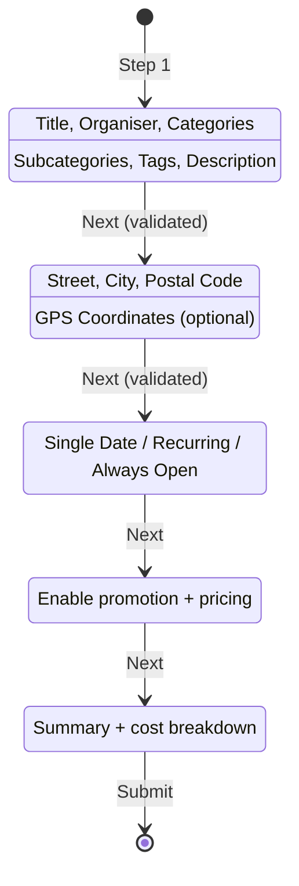
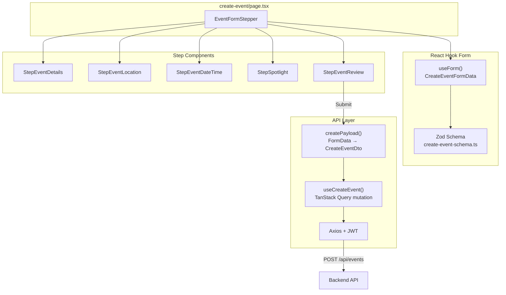
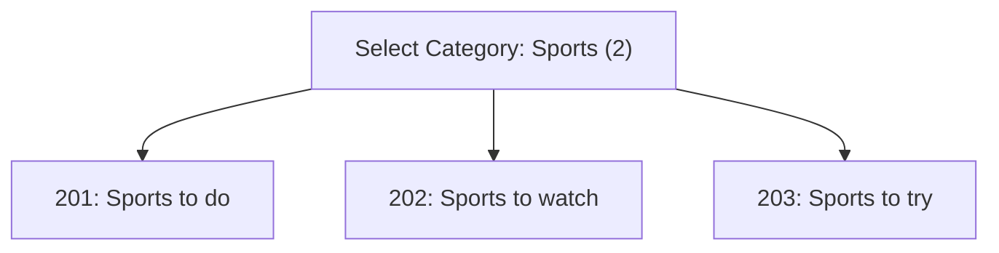
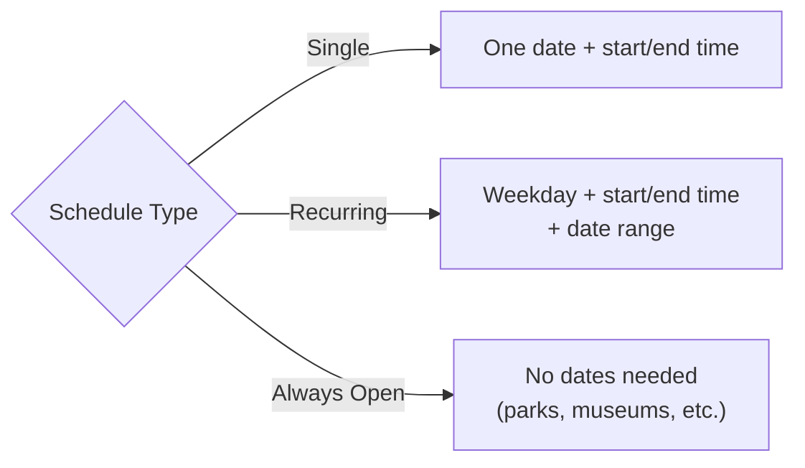
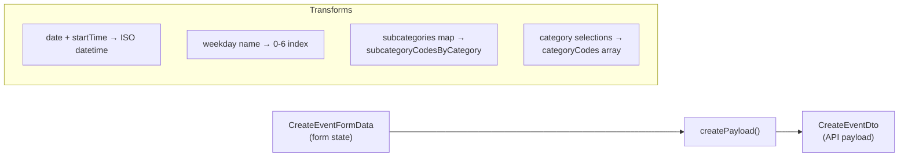
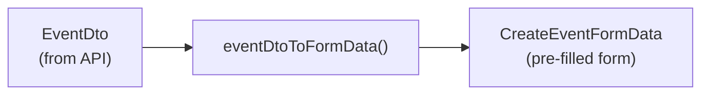
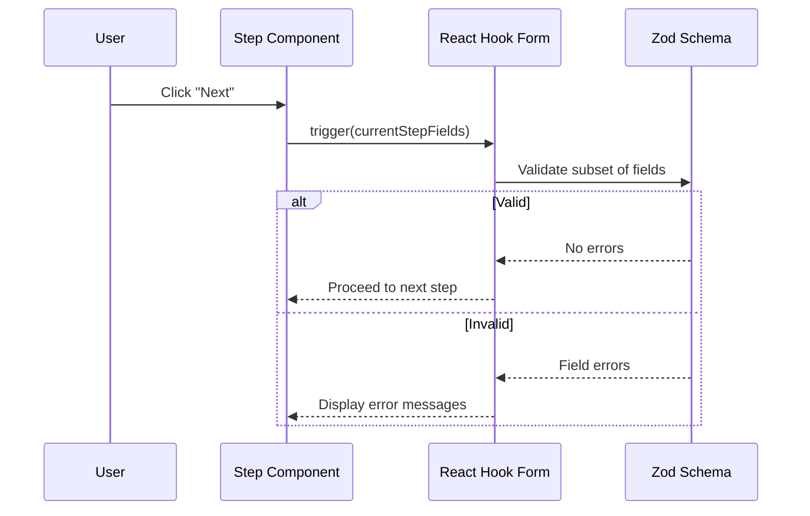

# Form Guide

> How the multi-step event creation form works — the most complex part of the frontend.

## Overview

The event form is a **5-step wizard** that lets organisers create events. It handles validation per step, data transformation, and both create and edit modes.

---

## Architecture

### Key Files

| File | Role |
|------|------|
| `components/forms/EventFormStepper.tsx` | Orchestrator — manages step navigation and form state |
| `lib/validation/create-event-schema.ts` | Zod schema + `createPayload()` + `eventDtoToFormData()` |
| `hooks/useEventForm.ts` | Wraps `useForm()` with Zod resolver |
| `hooks/useCreateEvent.ts` | TanStack Query mutation for POST |
| `hooks/useEvents.ts` | `useUpdateEvent` mutation for PUT (edit mode) |
| `components/forms/steps/Step*.tsx` | Individual step UI components |

---

## The 5 Steps

### Step 1: Event Details (`StepEventDetails.tsx`)

What the user fills in:
- **Title** (required, max 200 chars)
- **Organiser name** and **organisation number** (Swedish Luhn validation)
- **Categories** (select from 8 categories)
- **Subcategories** (3 per selected category)
- **Filter tags** (Free, Family-friendly, Indoor, Outdoor, etc.)
- **Description**, **image URL**, **website URL**

Category selection is the most complex part — subcategories are nested under categories:

The form stores subcategories as `Record<number, number[]>` keyed by category code.

### Step 2: Location (`StepEventLocation.tsx`)

- **Street name** (required)
- **City** (required)
- **Postal code** (optional)
- **GPS coordinates** (optional — backend can auto-geocode)

### Step 3: Date & Time (`StepEventDateTime.tsx`)

Three scheduling modes:

- **Single date**: Pick a date, set start and end times
- **Recurring**: Select weekdays (0-6), set times, define a date range
- **Always open**: Toggle — no dates needed (used for places like parks)

### Step 4: Spotlight (`StepSpotlight.tsx`)

Optional event promotion:
- Enable/disable spotlight
- Select date range for promotion
- Pricing: 99 SEK/day + 125 SEK flat VAT
- Cost breakdown shown in real-time

### Step 5: Review (`StepEventReview.tsx`)

Read-only summary of all previous steps. Shows:
- All event details
- Spotlight cost breakdown (if enabled)
- Submit button that triggers `createPayload()` → API call

---

## Data Transformation

The form state (`CreateEventFormData`) doesn't match the API format (`CreateEventDto`). The `createPayload()` function transforms it:

### Key transformations:

| Form Field | API Field | Transform |
|-----------|-----------|-----------|
| `date` + `startTime` | `singleDate.startDate` | Combined into ISO string |
| `"Monday"` | `recurringSchedule.dayOfWeek` | Mapped to `1` |
| `subcategories: { 2: [201, 203] }` | `subcategoryCodesByCategory` | Passed directly |
| Selected category toggles | `categoryCodes: [1, 2]` | Extracted from subcategory keys |

### Edit Mode: Reverse Transformation

When editing, `eventDtoToFormData()` converts an `EventDto` back into form state:

The edit page at `/my-events/[id]/edit` fetches the event, transforms it, and passes it to the same `EventFormStepper` used for creation.

---

## Validation

Validation runs **per step** — you can't proceed to the next step without passing the current step's rules.

The Zod schema in `create-event-schema.ts` defines all validation rules:
- Required fields (title, city, etc.)
- String lengths (max 200 for title)
- Swedish organisation number (Luhn algorithm)
- Valid date ranges
- GPS coordinate format

---

## Adding a New Form Field

1. **Add to Zod schema** in `lib/validation/create-event-schema.ts`
2. **Add to the Step component** that should display it
3. **Update `createPayload()`** to include it in the API payload
4. **Update `eventDtoToFormData()`** to populate it in edit mode
5. **Update `types/events.ts`** if the DTO interface changes
6. **Update `contentText.tsx`** if it's a new category/tag

---

## What's Next

- **[Development Workflow](DEVELOPMENT-WORKFLOW.md)** — Branching, linting, and PR process
- **[docs/ARCHITECTURE.md](../docs/ARCHITECTURE.md)** — Full architecture with deployment diagrams
