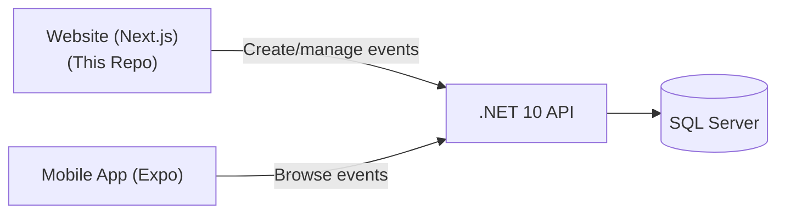

# Getting Started

> From zero to a running dev server in 10 minutes.

## What You're Building

The GODO Frontend is the **organiser-facing website** where event organisers create, manage, and promote events. It's one part of a 3-repo platform:



Organisers use this website. Users browse events on the mobile app. Both talk to the same backend API.

---

## Prerequisites

| Tool | Version | Install |
|------|---------|---------|
| Node.js | 20+ | [nodejs.org](https://nodejs.org/) |
| npm | 10+ | Comes with Node.js |
| Git | 2.30+ | [git-scm.com](https://git-scm.com/) |
| IDE | Any | VS Code recommended |

**Verify Node is installed:**
```bash
node --version   # Should print v20.x.x or higher
npm --version    # Should print 10.x.x or higher
```

---

## Step 1: Clone the Repository

```bash
git clone https://github.com/Go-Do-AB/Frontend.git
cd Frontend
```

## Step 2: Install Dependencies

```bash
npm install
```

This installs Next.js, React, Tailwind, shadcn/ui, TanStack Query, and all other packages.

## Step 3: Configure Environment

Create a `.env.local` file in the project root:

```bash
NEXT_PUBLIC_API_URL=http://localhost:5198/api
```

This points the frontend to your local backend API. For production, this is set to `https://api.godo-dev.nu/api`.

> **Note:** The backend must be running for the frontend to work. See the [Backend Getting Started](https://github.com/Go-Do-AB/Backend/blob/main/forDevelopers/GETTING-STARTED.md) guide.

## Step 4: Run the Dev Server

```bash
npm run dev
```

The site opens at [http://localhost:3000](http://localhost:3000). It uses **Turbopack** for fast hot reloading.

## Step 5: Verify It Works

1. Open [http://localhost:3000](http://localhost:3000) — you should see the login page
2. Log in with a seeded account:

| Account | Username | Password | Role |
|---------|----------|----------|------|
| Admin | `martina-godo` | `martina-godo1` | Admin + Organiser |
| Organiser | `seed.organiser` | `organiser123` | Organiser |

3. After login, you should see the landing page with "Create Event" and "My Events"

---

## Common Issues

| Problem | Solution |
|---------|----------|
| Login fails / network error | Make sure the backend API is running on port 5198 |
| `NEXT_PUBLIC_API_URL` not working | Restart the dev server after changing `.env.local` |
| npm install fails | Try deleting `node_modules` and `package-lock.json`, then `npm install` |
| Port 3000 in use | Kill the process or use `npm run dev -- -p 3001` |

---

## What's Next

1. **[Project Walkthrough](PROJECT-WALKTHROUGH.md)** — Understand the folder structure and key files
2. **[Form Guide](FORM-GUIDE.md)** — How the multi-step event creation form works
3. **[Development Workflow](DEVELOPMENT-WORKFLOW.md)** — Branch strategy and PR process
