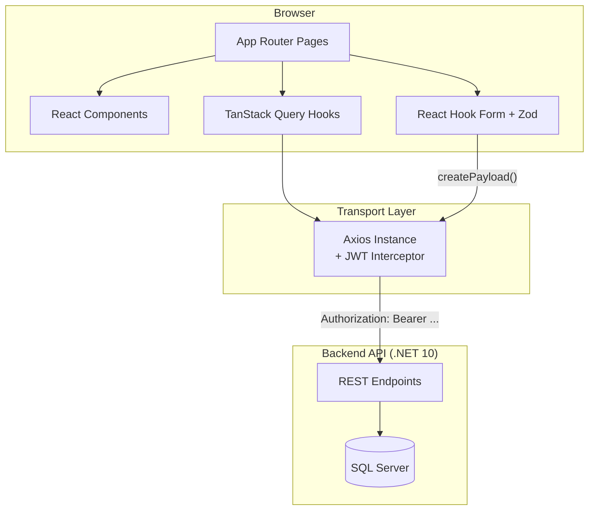
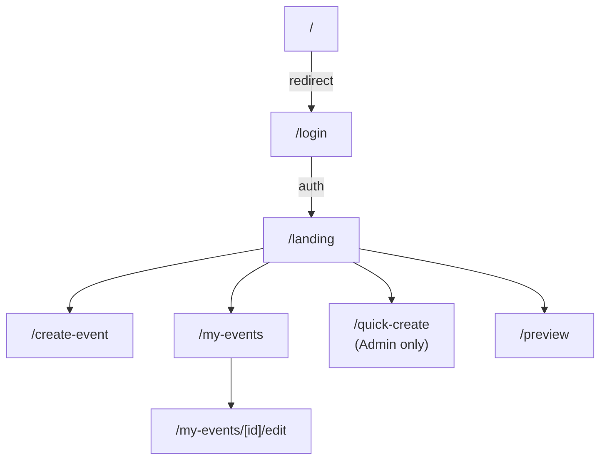
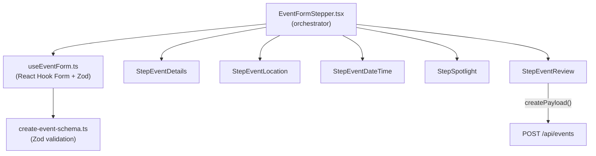
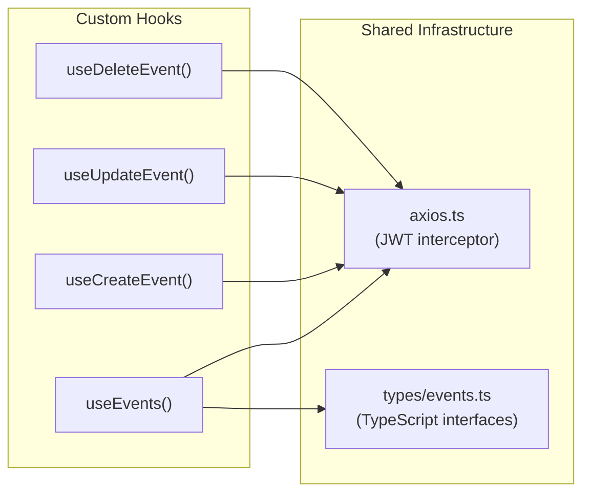
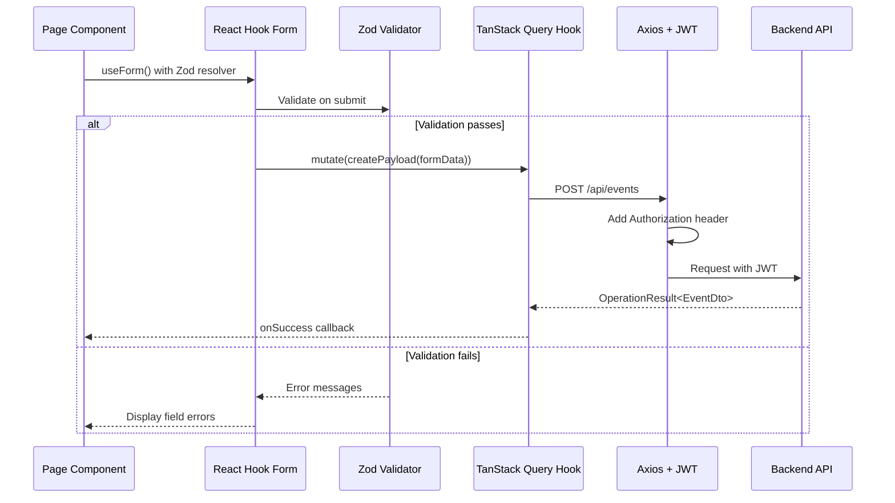

# Project Walkthrough

> A visual tour of the codebase — what each folder does and how they connect.

## High-Level Architecture



---

## Folder Structure

```
Frontend/
├── src/
│   ├── app/                          # Next.js App Router (pages)
│   │   ├── layout.tsx                # Root layout (providers, navbar, fonts)
│   │   ├── page.tsx                  # "/" → redirects to /login
│   │   ├── (auth)/                   # Auth route group (no layout nesting)
│   │   │   ├── login/page.tsx        # Organiser login form
│   │   │   ├── register/page.tsx     # Organiser registration form
│   │   │   └── forgot-password/      # Forgot password (placeholder)
│   │   ├── landing/page.tsx          # Main hub after login (role-based UI)
│   │   ├── create-event/page.tsx     # Multi-step event creation form
│   │   ├── my-events/
│   │   │   ├── page.tsx              # Organiser's event dashboard
│   │   │   └── [id]/edit/page.tsx    # Edit existing event
│   │   ├── quick-create/page.tsx     # Admin-only simplified event creation
│   │   └── preview/page.tsx          # Mobile app preview mockup
│   │
│   ├── components/
│   │   ├── global/
│   │   │   └── Navbar.tsx            # Top navigation bar (logo, search, logout)
│   │   ├── forms/
│   │   │   ├── EventFormStepper.tsx  # Multi-step form orchestrator (the big one)
│   │   │   ├── QuickCreateForm.tsx   # Simplified admin form
│   │   │   ├── TimePicker.tsx        # Custom time selector
│   │   │   └── steps/               # Individual form steps
│   │   │       ├── StepEventDetails.tsx    # Step 1: Title, org, categories
│   │   │       ├── StepEventLocation.tsx   # Step 2: Address, GPS
│   │   │       ├── StepEventDateTime.tsx   # Step 3: Dates and times
│   │   │       ├── StepSpotlight.tsx       # Step 4: Promotion pricing
│   │   │       └── StepEventReview.tsx     # Step 5: Review and submit
│   │   ├── events/
│   │   │   └── EventTicketCard.tsx   # Success card after event creation
│   │   ├── preview/                  # Mobile app mockup components
│   │   └── ui/                       # shadcn/ui components (button, card, dialog, etc.)
│   │
│   ├── hooks/
│   │   ├── useEvents.ts             # CRUD hooks: useEvents, useEvent, useUpdateEvent, etc.
│   │   ├── useCreateEvent.ts        # Create event mutation
│   │   ├── useQuickCreateEvent.ts   # Quick-create mutation
│   │   └── useEventForm.ts          # Form hook with Zod resolver
│   │
│   ├── lib/
│   │   ├── axios.ts                 # Shared Axios instance + JWT interceptor
│   │   ├── utils.ts                 # Helpers (date formatting, org nr validation, cn())
│   │   ├── content/
│   │   │   └── contentText.tsx      # Category/subcategory/tag definitions (must match backend)
│   │   └── validation/
│   │       ├── create-event-schema.ts    # Zod schema + createPayload() + eventDtoToFormData()
│   │       └── quick-create-schema.ts    # Quick-create Zod schema
│   │
│   ├── providers/
│   │   └── react-query-provider.tsx  # TanStack Query provider setup
│   │
│   └── types/
│       └── events.ts                # TypeScript interfaces (matches backend DTOs exactly)
│
├── public/                          # Static assets (images, icons)
├── Dockerfile                       # Multi-stage Docker build for production
├── next.config.ts                   # Next.js config (standalone output)
├── tailwind.config.ts               # Tailwind CSS config
├── package.json                     # Dependencies and scripts
└── docs/                            # Reference documentation
```

---

## Key Files Deep-Dive

### Pages (App Router)



Each page is a `page.tsx` file inside `src/app/`. The App Router handles routing automatically based on the folder structure.

### The Form System

The event form is the most complex part of the frontend:



- **`EventFormStepper.tsx`** — Controls step navigation, holds form state
- **`create-event-schema.ts`** — Zod schema for validation + `createPayload()` to transform form data to API format
- **Each Step component** — Renders its portion of the form, uses `useFormContext()` to access shared form state

### Data Layer



- **`axios.ts`** — Single Axios instance with JWT interceptor that reads `accessToken` from localStorage
- **`types/events.ts`** — TypeScript interfaces matching the backend DTOs exactly
- **Hooks** — Wrap TanStack Query's `useQuery`/`useMutation` for type-safe API calls

### Content Definitions

**`contentText.tsx`** contains the category, subcategory, and tag definitions. These **must match the backend's DataSeeder exactly**.

| What | Codes | Example |
|------|-------|---------|
| Categories | 1-8 | Sports (2) |
| Subcategories | catCode*100 + index | Sports to do (201) |
| Tags | 1001-1006 | Free (1001) |

---

## How Everything Connects



---

## Key Files to Read First

| # | File | Why |
|---|------|-----|
| 1 | `src/app/layout.tsx` | Root layout — providers, navbar, global setup |
| 2 | `src/lib/axios.ts` | How all API calls are made, JWT handling |
| 3 | `src/components/forms/EventFormStepper.tsx` | The core form — most complex component |
| 4 | `src/lib/validation/create-event-schema.ts` | Form validation + API payload transformation |
| 5 | `src/hooks/useEvents.ts` | How data fetching works with TanStack Query |

---

## What's Next

- **[Form Guide](FORM-GUIDE.md)** — Deep-dive into the multi-step event form
- **[Development Workflow](DEVELOPMENT-WORKFLOW.md)** — How to make changes, lint, and submit PRs
