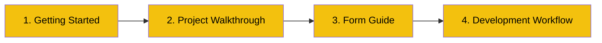

# Developer Guides

> Hands-on guides for developers working on the GODO Frontend (Website).

## What's Here

These guides are written for developers who are **new to the project** or need a refresher. They focus on *how to work* in this codebase — not just what exists.

| Guide | What You'll Learn | Time |
|-------|-------------------|------|
| [Getting Started](GETTING-STARTED.md) | Clone, install, run the dev server | 10 min |
| [Project Walkthrough](PROJECT-WALKTHROUGH.md) | Visual tour of every folder and key file | 20 min |
| [Form Guide](FORM-GUIDE.md) | How the multi-step event form works | 20 min |
| [Development Workflow](DEVELOPMENT-WORKFLOW.md) | Branching, linting, CI/CD, PR checklist | 15 min |

## Recommended Reading Order

**First day?** Start with Getting Started, then Project Walkthrough.
**Ready to code?** Read Form Guide, then Development Workflow.

## How This Relates to `docs/`

| Folder | Purpose |
|--------|---------|
| `forDevelopers/` | How-to guides, tutorials, onboarding |
| `docs/` | Reference documentation (architecture, API integration, deployment) |

## Other Repos

| Repo | Description | Developer Guides |
|------|-------------|------------------|
| [Backend (.NET 10)](https://github.com/Go-Do-AB/Backend) | API server | `forDevelopers/` in that repo |
| [Mobile App (Expo)](https://github.com/Go-Do-AB/MobileApp) | iOS/Android app for end users | `forDevelopers/` in that repo |
