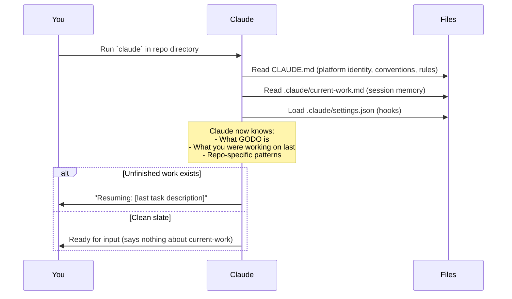
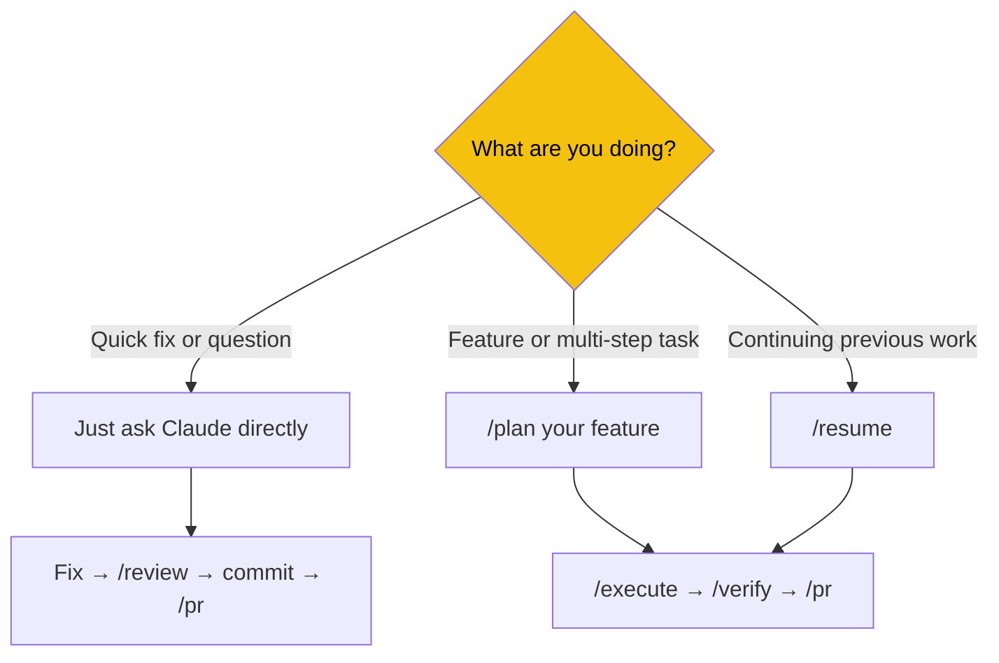

# Your First Claude Code Session

> What happens when you open Claude Code in a GODO repo, and what to do first.

## What Happens Automatically

When you run `claude` in any GODO repo directory, several things happen before you type anything:



### What Claude Already Knows

From `CLAUDE.md` (loaded automatically every session):
- GODO is a **multi-city event management platform** (not just Helsingborg)
- The repo's architecture, key patterns, and conventions
- Git/commit rules (branch naming, commit format, Co-Authored-By footer)
- Cross-repo awareness (Backend API defines contracts for Frontend and MobileApp)
- All available slash commands

### What Claude Does NOT Load at Startup

To save context window space, these are loaded **on demand** via `/scope`:
- Category/subcategory tables
- Full API endpoint reference
- Test infrastructure details
- Component inventories
- Form architecture details

## Your First Steps

### Step 1: Check What's in Progress

```
/status
```

This shows:
- Current branch and recent commits
- What `.claude/current-work.md` says about recent work
- Whether there's an active plan in `.planning/STATE.md`

**Example output:**
```
## Status

**Repo:** Backend (.NET 10)
**Branch:** main (clean)
**Last 3 commits:**
  - 94932d1 docs: update session tracker
  - d72809a fix: initial seeding bug
  - 359a398 fix: normalize event URLs

**Current work:** Google Play Store Deployment (LIVE on Internal Testing)
**Active plan:** Bug Fix — Event Detail CTA Links (COMPLETE)

No uncommitted changes.
```

### Step 2: Load Context for Your Task

If you're about to work on something specific, load the relevant reference files:

```
/scope categories    # Working with event categories
/scope endpoints     # Working with API routes
/scope tests         # Writing or fixing tests
/scope all           # Load everything (uses more context — use sparingly)
```

> **Tip:** Only load what you need. Each `/scope` call adds content to Claude's context window, and that space is finite.

### Step 3: Start Working

You have three paths depending on what you're doing:



#### Path A: Quick Fix or Question
Just describe what you need:
```
"The /api/events endpoint returns 500 when city has special chars — fix it"
"Explain how the HelsingborgEventProfile mapping works"
"Add a unit test for the URL normalization helper"
```

Claude will investigate, fix, and you can commit when ready.

#### Path B: Planned Feature
```
/plan add event spotlight feature
```
Claude creates a phased plan, then you execute phase by phase. See [Planning & Execution](03-PLANNING-AND-EXECUTION.md).

#### Path C: Resuming Previous Work
```
/resume
```
Claude reads saved state and tells you where you left off. See [Context & Sessions](04-CONTEXT-AND-SESSIONS.md).

## Hooks — What Are Those Messages?

You'll see automatic messages from hooks configured in `.claude/settings.json`:

### When You Edit Source Files

```
[hook] .cs file modified — run dotnet format before commit
```
This fires whenever a `.cs` file is modified (Backend). Frontend/MobileApp show similar for `.ts/.tsx` files.

**What to do:** Run `dotnet format` (or let Claude do it) before committing. The pre-commit hook (`husky`) will reject unformatted code anyway.

### When You Type a Message During Active Planning

```
[context] Active plan detected — read .planning/STATE.md for current state
```
This fires when `.planning/STATE.md` exists, reminding Claude to check the current plan status.

**What to do:** Nothing — this is for Claude's benefit, not yours. It ensures Claude stays aware of your active feature plan.

## Settings and Permissions

### `.claude/settings.json` — Hooks (Shared)
Defines the hooks described above. You shouldn't need to edit this.

### `.claude/settings.local.json` — Permissions (Personal)
Controls which shell commands Claude can run without asking permission. Pre-configured to allow:
- `dotnet` commands (build, test, format, ef)
- `git` commands (status, diff, log, add, commit, push)
- `gh` commands (PR creation, project board)
- `npm` commands (test, lint, build)

**If Claude keeps asking permission for a command you trust**, you can add it to `settings.local.json`. But be cautious — the permission list exists for safety.

## The `.claude/` Directory — What's What

```
.claude/
├── commands/              # Slash command definitions (don't edit unless adding commands)
│   ├── plan.md            # /plan — creates feature plans
│   ├── execute.md         # /execute — runs current phase
│   ├── verify.md          # /verify — runs all checks
│   └── ... (15+ more)
│
├── reference/             # Detailed context loaded by /scope
│   ├── categories.md      # Category/subcategory/tag tables
│   ├── endpoints.md       # Full API endpoint reference
│   └── ... (varies by repo)
│
├── patterns/              # Code templates Claude uses for scaffolding
│   ├── command-template.md  # (BE) New CQRS command
│   ├── page-template.md    # (FE) New Next.js page
│   └── ... (varies by repo)
│
├── templates/planning/    # Templates for the planning lifecycle
│   ├── STATE.md           # Feature plan state format
│   ├── PHASE.md           # Per-phase detail format
│   └── SUMMARY.md         # Completion summary format
│
├── current-work.md        # Session memory (auto-updated on commits)
├── settings.json          # Hook configuration (shared, committed)
└── settings.local.json    # Permission overrides (personal, gitignored)
```

## Common First-Session Questions

**Q: Do I need to read CLAUDE.md?**
No. It's written for Claude, not for you. But reading it can help you understand what Claude knows and what rules it follows.

**Q: Can I edit `.claude/commands/` files?**
Yes, but coordinate with the team — these are committed to git and shared. If you want to add a custom command, create a new `.md` file in the `commands/` directory.

**Q: What if I break something?**
The `.claude` infrastructure is all git-tracked. You can always revert. The only exception is `settings.local.json`, which is gitignored (personal settings).

**Q: Does Claude remember between sessions?**
Yes — through `.claude/current-work.md` and `.planning/STATE.md`. These files persist between sessions and Claude reads them on startup. Claude also has a memory system in `~/.claude/` for cross-project memory.

---

**Next:** [Slash Commands Reference →](02-SLASH-COMMANDS.md)
