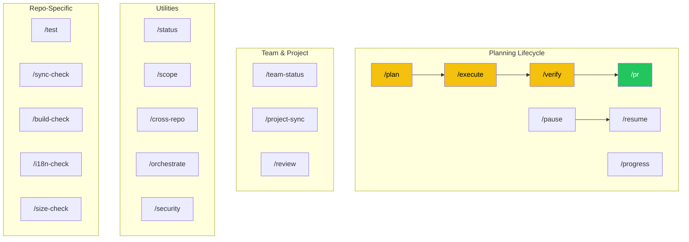

# Slash Commands Reference

> Every command available in the GODO Claude Code setup, with usage and expected output.

## How Slash Commands Work

Slash commands are defined as `.md` files in `.claude/commands/`. When you type `/plan`, Claude reads `.claude/commands/plan.md` and follows the instructions inside.

You can also type them as part of a sentence:
```
/plan add event search feature
/scope categories
/test unit
```

## Command Map



---

## Planning Lifecycle Commands

### `/plan <feature description>`

**Purpose:** Create a feature plan with phases, requirements, and a roadmap.

**Usage:**
```
/plan add city-based event filtering
/plan refactor auth service to use CQRS
/plan add event search with autocomplete
```

**What it does:**
1. Investigates the codebase for related files and patterns
2. Presents requirements for your approval
3. Creates a phased roadmap (each phase fits in one session)
4. Saves to `.planning/STATE.md`
5. Links to relevant GitHub issues

**Example output:**
```
## Feature: City-Based Event Filtering

### Requirements
- [ ] Add city filter parameter to aggregated events endpoint
- [ ] Case-insensitive matching
- [ ] Works alongside existing category/date filters

### Roadmap

#### Phase 1: Backend Filter — small
- [ ] Add City property to EventFilterDto
- [ ] Update GetAggregatedEventsQueryHandler
- [ ] Add 3 unit tests

#### Phase 2: MobileApp Integration — small
- [ ] Add city picker to filter sheet
- [ ] Wire to useEvents hook

Saved to .planning/STATE.md
Run /execute to start Phase 1.
```

---

### `/execute`

**Purpose:** Execute the current phase from `.planning/STATE.md`.

**Usage:**
```
/execute
```

**What it does:**
1. Reads `.planning/STATE.md` for the current phase
2. Loads relevant patterns from `.claude/patterns/`
3. Works through tasks one by one
4. Checks off completed tasks in STATE.md
5. Updates progress when the phase is done

**Example output:**
```
Starting Phase 1: Backend Filter (Tasks: 0/3)

Task 1: Add City property to EventFilterDto
  → Editing Application/Events/Dtos/EventDtos.cs
  ✓ Done

Task 2: Update query handler
  → Adding city filter with StringComparison.OrdinalIgnoreCase
  ✓ Done

Task 3: Add unit tests
  → Running: dotnet test --filter "City"
  → 3 tests passed
  ✓ Done

Phase 1 complete! [██████████░░░░░░░░░░] 1/2 phases
Run /execute for Phase 2 or /verify to check Phase 1.
```

---

### `/verify`

**Purpose:** Run all build, test, lint, and quality checks.

**Usage:**
```
/verify
```

**What it runs (varies by repo):**

| Repo | Checks |
|------|--------|
| Backend | `dotnet build` → `dotnet test` → `dotnet format --verify-no-changes` |
| Frontend | `npm run lint` → `npx tsc --noEmit` → `npm run build` |
| MobileApp | `npm test` → `npx tsc --noEmit` |

Also reviews changed files for security issues and cross-repo consistency.

**Example output:**
```
## Verification Report

### Build & Test
- [x] dotnet build — Success
- [x] dotnet test — 253/253 passed
- [x] dotnet format — Clean

### Code Review
- [x] No security concerns
- [x] Follows conventions

### Cross-Repo Impact
- [!] MobileApp needs updated types for new City parameter

Verdict: Ready for PR (with cross-repo note)
```

---

### `/pr`

**Purpose:** Create a pull request following GODO conventions.

**Usage:**
```
/pr
```

**What it does:**
1. Gathers all commits since `main`
2. Analyzes the full diff (not just latest commit)
3. Creates PR with summary, changes, test plan
4. Updates GitHub Project Board items

**Example output:**
```
Created PR #68: "feat: add city-based event filtering"

## Summary
- Add city filter to aggregated events endpoint
- Case-insensitive matching works alongside existing filters

## Test Plan
- [x] 3 new unit tests pass
- [ ] Manual: GET /api/events/aggregated?city=Helsingborg

Project board: Issue #42 moved to "In Review"
```

---

### `/pause`

**Purpose:** Save all state before ending a session.

**Usage:**
```
/pause
```

**What it saves:**
- Updates `.planning/STATE.md` with current position
- Updates `.claude/current-work.md` with accomplishments, next steps, decisions
- Reports uncommitted changes

**Example output:**
```
Saved state:
  .claude/current-work.md — updated with Phase 1 completion
  .planning/STATE.md — progress bar updated, session logged

You have 0 uncommitted changes. Safe to close.
```

---

### `/resume`

**Purpose:** Resume work from a saved state with a quick briefing.

**Usage:**
```
/resume
```

**What it does:**
1. Reads `.claude/current-work.md` and `.planning/STATE.md`
2. Checks git status
3. Gives a brief summary
4. Suggests the next command

**Example output:**
```
Resuming: City-Based Event Filtering
  Phase 1 complete (Backend Filter)
  Phase 2 ready (MobileApp Integration)
  Branch: main, clean tree

Run /execute to start Phase 2.
```

---

### `/progress`

**Purpose:** Show project state and route to the next action.

**Usage:**
```
/progress
```

**Example output:**
```
## City-Based Event Filtering
[██████████░░░░░░░░░░] 1/2 phases

### Phase 1: Backend Filter — COMPLETE
- [x] Add City to EventFilterDto
- [x] Update query handler
- [x] Add unit tests

### Phase 2: MobileApp Integration — PENDING
- [ ] Add city picker
- [ ] Wire useEvents hook

Next: /execute to start Phase 2
```

---

## Team & Project Commands

### `/team-status`

**Purpose:** Team dashboard — who's working on what across all repos.

**Usage:**
```
/team-status
```

**What it shows:**
- Open PRs per team member across Backend, Frontend, MobileApp
- Active branches
- Project board items needing attention
- Stale items

**Example output:**
```
## Team Dashboard — 2026-03-17

### Nemanja1208
- PR #125 (Backend) — "docs: session tracker update" — Merged
- Branch: main (all repos)

### KristinaK993
- PR #41 (Frontend) — "Style event cards" — Open (2 days)

### Items Needing Attention
- PR #41 needs review
- Issue #50 is "Ready for Sprint" with no assignee
```

---

### `/project-sync`

**Purpose:** Sync GitHub Project Board statuses with actual PR/branch state.

**Usage:**
```
/project-sync
```

**Example output:**
```
## Project Board Sync

### Mismatches
1. PR #125 merged → Issue #120 still "In Progress" → Move to "Done"?
2. PR #41 opened → Issue #38 still "Ready for Sprint" → Move to "In Review"?

### In Sync
- 14 items correctly positioned
```

---

### `/review`

**Purpose:** Review staged and unstaged changes before committing.

**Usage:**
```
/review
```

**What it checks:**
- Code quality and conventions
- Security concerns (hardcoded secrets, SQL injection, etc.)
- Cross-repo impact
- Missing tests

**Example output:**
```
## Code Review

### Changes (3 files)
  M  Application/Events/Dtos/EventDtos.cs (+1 line)
  M  Application/Events/Queries/GetAggregatedEventsQueryHandler.cs (+8 lines)
  A  Test/Events/Queries/GetAggregatedEventsQueryHandlerTests.cs (+45 lines)

### Assessment
- [x] Follows CQRS pattern
- [x] No security issues
- [x] Tests cover new logic
- [!] New filter parameter — Frontend/MobileApp may need updates

Verdict: Good to commit
```

---

## Utility Commands

### `/status`

**Purpose:** Quick overview of current work and git state.

**Usage:**
```
/status
```

Lighter than `/progress` — just shows branch, recent commits, and current work summary.

---

### `/scope <area>`

**Purpose:** Load reference files into Claude's context on demand.

**Usage:**
```
/scope categories     # Category/subcategory/tag tables
/scope endpoints      # API endpoint reference (Backend)
/scope tests          # Test infrastructure
/scope form           # Multi-step form architecture (Frontend)
/scope components     # Component inventory (MobileApp)
/scope all            # Everything (uses more context)
```

**Available areas vary by repo:**

| Backend | Frontend | MobileApp |
|---------|----------|-----------|
| `categories` | `form` | `screens` |
| `endpoints` | `files` | `components` |
| `files` | `api` | `data` |
| `tests` | `components` | `filter` |
| `ai` | `all` | `events` |
| `production` | | `types` |
| `cqrs` | | `i18n` |
| `all` | | `refactor` |
| | | `all` |

---

### `/cross-repo`

**Purpose:** Check consistency across Backend, Frontend, and MobileApp.

**Usage:**
```
/cross-repo
```

**What it checks:**
- Category codes match across all repos
- API types align with Backend DTOs
- Endpoint URLs are consistent

---

### `/orchestrate <task>`

**Purpose:** Delegate work across multiple repos.

**Usage:**
```
/orchestrate add "Water sports" subcategory to all repos
/orchestrate sync EventDto types across Frontend and MobileApp
```

See [Cross-Repo Orchestration](05-CROSS-REPO-ORCHESTRATION.md) for detailed walkthrough.

---

### `/security`

**Purpose:** Run a security audit.

**Usage:**
```
/security
```

**What it checks:**

| Repo | Checks |
|------|--------|
| Backend | `dotnet list package --vulnerable` + secret scan |
| Frontend | `npm audit` + secret scan |
| MobileApp | `npm audit` + secret scan |

Plus: scans for hardcoded secrets, exposed environment variables, OWASP top 10.

---

## Repo-Specific Commands

### `/test [filter]` — Backend Only

**Purpose:** Run tests with smart filtering.

**Usage:**
```
/test              # All 250 tests
/test unit         # 204 unit tests only
/test integration  # 46 integration tests only
/test mapping      # AutoMapper profile tests
/test validator    # FluentValidation tests
/test command      # CQRS command handler tests
/test auth         # Authentication tests
/test event        # Event-related tests
```

---

### `/sync-check` — Backend Only

**Purpose:** Check external event sync health (Helsingborg API integration).

**Usage:**
```
/sync-check
```

Shows: API health, last sync time, configuration, error status.

---

### `/build-check` — Frontend Only

**Purpose:** Quick lint + type check + build.

**Usage:**
```
/build-check
```

Runs: `npm run lint` → `npx tsc --noEmit` → `npm run build`

---

### `/i18n-check` — MobileApp Only

**Purpose:** Scan for hardcoded strings that should use `t()` translations.

**Usage:**
```
/i18n-check
```

---

### `/size-check` — MobileApp Only

**Purpose:** Find components exceeding the 150-line limit.

**Usage:**
```
/size-check
```

---

**Next:** [Planning & Execution →](03-PLANNING-AND-EXECUTION.md)
