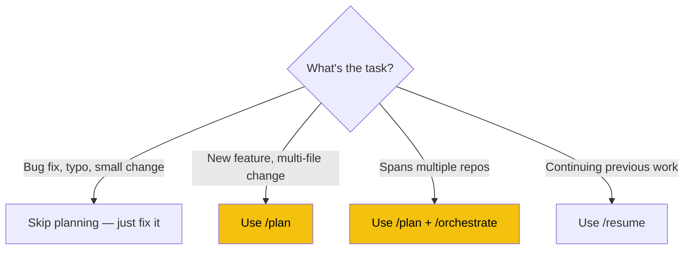
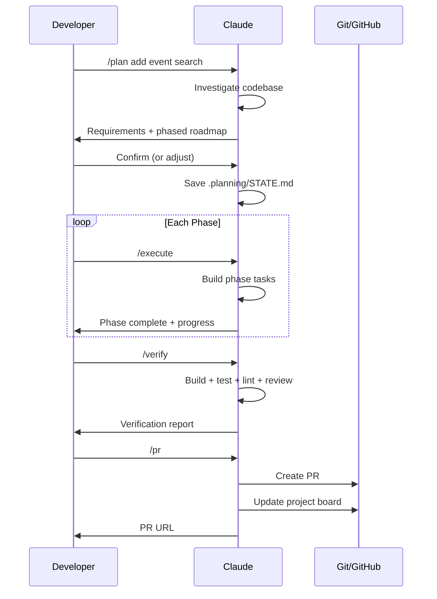
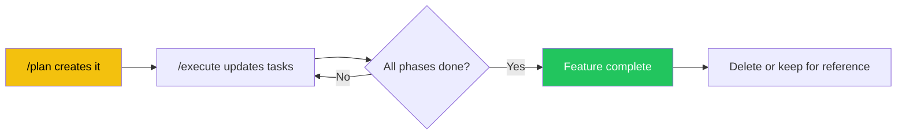

# Planning & Execution

> The full lifecycle for building features: plan → execute → verify → PR.

## When to Use Planning



**Use planning when:**
- The task touches 3+ files
- The task spans multiple sessions
- The task affects multiple repos
- You want Claude to break work into manageable phases

**Skip planning when:**
- Quick bug fix (< 30 min)
- Single file change
- Question or exploration
- Documentation update

## The Full Lifecycle



## Step-by-Step Walkthrough

### 1. Create the Plan

```
/plan add event search with category-aware autocomplete
```

Claude will:
1. **Investigate** — reads relevant files, checks existing patterns, identifies affected modules
2. **Present requirements** — a checklist of what needs to be built
3. **Create a roadmap** — phased plan where each phase fits in ~1 session
4. **Save state** — writes everything to `.planning/STATE.md`

**You should:**
- Review the requirements — add, remove, or adjust items
- Review the phases — suggest splitting or combining if needed
- Confirm when you're happy with the plan

> **Tip:** Be specific in your plan description. "add search" is vague. "add event search with category-aware autocomplete that queries the aggregated endpoint" gives Claude much more to work with.

### 2. Execute Phase by Phase

```
/execute
```

Claude reads `.planning/STATE.md`, finds the current phase, and works through each task:

```
Starting Phase 1: Backend Search Endpoint (Tasks: 0/4)

Task 1: Create SearchEventsQuery
  → Using pattern from .claude/patterns/query-template.md
  → Created Application/Events/Queries/SearchEventsQuery.cs
  → Created Application/Events/Queries/SearchEventsQueryHandler.cs
  ✓ Done

Task 2: Add search to AggregatedEventsController
  → Reading existing controller...
  → Added GET /api/events/aggregated/search endpoint
  ✓ Done

...

Phase 1 complete! [██████████░░░░░░░░░░] 1/3 phases
```

**Between phases, you can:**
- Run `/verify` to validate the completed phase
- Run `/progress` to see the overall status
- Commit the phase's work
- Continue with `/execute` for the next phase

### 3. Verify Everything

```
/verify
```

This runs all checks appropriate to the repo:

**Backend:** `dotnet build` → `dotnet test` → `dotnet format --verify-no-changes` → code review → cross-repo check

**Frontend:** `npm run lint` → `npx tsc --noEmit` → `npm run build` → code review → cross-repo check

**MobileApp:** `npm test` → `npx tsc --noEmit` → code review → cross-repo check

If verification fails, Claude tells you what's wrong and you can fix it before creating a PR.

### 4. Create the PR

```
/pr
```

Claude:
1. Gathers all commits since `main` (not just the latest)
2. Writes a PR with summary, changes list, and test plan
3. Creates the PR via `gh pr create`
4. Checks the GitHub Project Board and offers to update issue statuses

## The `.planning/` Directory

### Structure

```
.planning/
└── STATE.md    # The living plan document
```

`STATE.md` is created by `/plan` and updated by `/execute`. It tracks:
- Feature name and goal
- Requirements checklist
- Phased roadmap with tasks
- Current position (phase X of N, task Y of M)
- Progress bar
- Decisions made during execution
- Cross-repo actions needed
- Session log

### Example STATE.md

```markdown
# Feature: Event Search with Autocomplete

> Created: 2026-03-17
> Status: Phase 2 in progress

## Goal
Add category-aware search to the aggregated events endpoint with autocomplete support.

## Requirements
- [x] Search by event title and description
- [x] Filter by category during search
- [ ] Return results with relevance scoring
- [ ] Autocomplete suggestions endpoint

## Roadmap

### Phase 1: Backend Search Query — small ✅
- [x] Create SearchEventsQuery + handler
- [x] Add search endpoint to controller
- [x] Add 5 unit tests

### Phase 2: Autocomplete + Scoring — medium (IN PROGRESS)
- [x] Add relevance scoring to search
- [ ] Create autocomplete suggestions endpoint
- [ ] Add integration tests

### Phase 3: MobileApp Integration — small
- [ ] Add search bar to home screen
- [ ] Wire to search endpoint
- [ ] Add loading/empty states

## Current Position
Phase: 2 of 3
Task:  1 of 3
Status: In progress

## Progress
[█████████████░░░░░░░] 4/9 tasks

## Decisions
| Date | Decision | Rationale |
|------|----------|-----------|
| 2026-03-17 | Use LIKE for search (not full-text) | Simpler, sufficient for MVP |
| 2026-03-17 | Score by title match > description match | Title matches are more relevant |

## Cross-Repo Actions
- MobileApp: Phase 3 requires search bar component
- Frontend: Consider adding search to organiser dashboard (future)
```

### Lifecycle of STATE.md



## Multi-Session Features

For features that span multiple sessions:

### Ending a Session Mid-Feature

```
/pause
```

This saves:
- Current phase and task position to `.planning/STATE.md`
- Summary of accomplishments to `.claude/current-work.md`
- Reports any uncommitted changes (commit them first!)

### Starting the Next Session

Two options:

**Option A — Explicit resume:**
```
/resume
```
Claude reads saved state and briefs you.

**Option B — Just start working:**
Claude reads `.claude/current-work.md` automatically on startup. If there's unfinished work, it mentions it. You can type `/execute` directly.

### Recommended Flow for Multi-Session Work

```
Session 1:
  /plan feature      → Create plan
  /execute           → Complete Phase 1
  commit             → Save Phase 1 code
  /pause             → Save state

Session 2:
  /resume            → Get briefing
  /execute           → Complete Phase 2
  commit             → Save Phase 2 code
  /verify            → Check everything
  /pr                → Create PR

Session 3 (if needed):
  /resume            → Address PR feedback
  fix issues         → Make changes
  commit + push      → Update PR
```

## Adjusting Plans Mid-Execution

Plans aren't rigid. You can:

**Add a task:** "Also add input validation for the search parameter"
Claude updates STATE.md with the new task.

**Skip a task:** "Let's skip the autocomplete for now — we'll do it in a follow-up"
Claude marks it as skipped and adjusts the plan.

**Split a phase:** "Phase 2 is too big — let's break it into 2a and 2b"
Claude restructures the plan.

**Change approach:** "Let's use full-text search instead of LIKE"
Claude records the decision and adjusts remaining tasks.

All changes are tracked in the Decisions table in STATE.md.

---

**Next:** [Context & Session Management →](04-CONTEXT-AND-SESSIONS.md)
