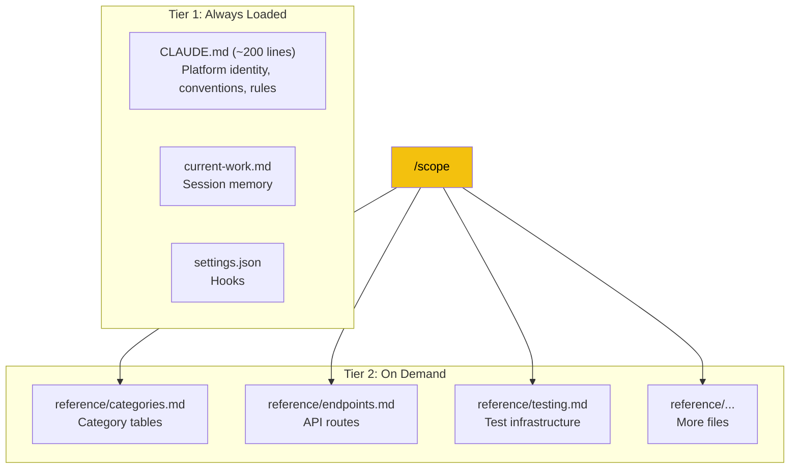
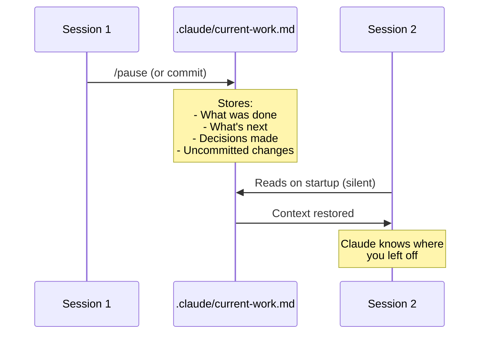

# Context & Session Management

> How Claude manages its context window, loads information on demand, and persists state between sessions.

## The Context Problem

Claude has a finite context window — it can only hold so much information at once. If we loaded every reference file at startup, we'd waste half the window before you even ask a question.

## Two-Tier Context System



### Tier 1 — Always Available
Loaded automatically every session:
- **CLAUDE.md** — Platform identity, architecture overview, conventions, command reference
- **current-work.md** — What happened last session, what's next
- **settings.json** — Hook configuration

### Tier 2 — Loaded via `/scope`
Only loaded when you need them:

```
/scope categories     # 8 categories, 24 subcategories, 6 tags
/scope endpoints      # Full API endpoint reference with parameters
/scope tests          # Test infrastructure, packages, file listing
/scope cqrs           # Command/query status table (Backend)
/scope form           # Multi-step form architecture (Frontend)
/scope components     # Component inventory (MobileApp)
```

## Context Tracking

Every Claude response ends with a context indicator:

```
📊 Context: ~15% used            ← Plenty of room
📊 Context: ~55% used ⚠️         ← Getting full, plan your remaining work
📊 Context: ~75% used 🔴         ← Use /pause or /compact soon
```

### What to Do at Each Level

| Level | Action |
|-------|--------|
| **< 50%** | Work normally. Load more `/scope` if needed. |
| **50-70%** | Avoid `/scope all`. Focus on finishing current task. |
| **> 70%** | Run `/pause` to save state, start a new session. Or use `/compact` to compress the conversation. |

### Tips for Conserving Context

1. **Use specific `/scope` calls**, not `/scope all`
2. **Don't paste entire files** into the chat — let Claude read them with tools
3. **Use `/pause` + `/resume`** for long features instead of one giant session
4. **Use `/compact`** (built-in Claude Code command) to compress conversation history
5. **Be specific** in your requests — "fix the city filter bug in GetAggregatedEventsQueryHandler" uses less context than "something's wrong with filtering"

## Session Persistence

### How It Works



### current-work.md — The Session Bridge

This file is updated:
- **Automatically** on every commit (Claude adds it to the commit)
- **Explicitly** when you run `/pause`

It contains:
- **Active task** — what you're working on
- **Current status** — what's been done
- **What's next** — remaining steps
- **Key decisions** — choices made during the session
- **Environment notes** — useful configuration details

### .planning/STATE.md — The Feature Bridge

For planned features, this file tracks:
- Which phase is current
- Which tasks are done
- Decisions and cross-repo actions

Both files together give Claude full context recovery when starting a new session.

## The `/pause` → `/resume` Cycle

### When Ending a Session

```
/pause
```

Claude will:
1. Update `.planning/STATE.md` (if active plan exists) with current position
2. Update `.claude/current-work.md` with accomplishments and next steps
3. Report any uncommitted changes

```
Saved state:
  .claude/current-work.md — Phase 2 complete, Phase 3 ready
  .planning/STATE.md — Tasks 1-3 checked, progress bar updated

⚠️ You have 2 uncommitted files:
  M Application/Events/Queries/SearchEventsQueryHandler.cs
  A Test/Events/Queries/SearchEventsQueryHandlerTests.cs

Commit before closing? Or these changes will only exist locally.
```

### When Starting a New Session

**Option A — Explicit:**
```
/resume
```

Claude reads everything and gives you a structured briefing:

```
Resuming: Event Search with Autocomplete
  Phases: 2 of 3 complete
  Current: Phase 3 (MobileApp Integration) — 0/3 tasks
  Branch: feature/event-search, 5 commits ahead of main
  Last session: Completed backend search + scoring

Run /execute to start Phase 3.
```

**Option B — Implicit:**

Just start Claude and ask a question or run a command. Claude reads `current-work.md` silently and only mentions it if there's unfinished work.

## Patterns Templates

When Claude generates code during `/execute`, it uses templates from `.claude/patterns/`:

| Repo | Templates |
|------|-----------|
| Backend | `command-template.md` (CQRS command), `query-template.md` (CQRS query), `entity-template.md` (domain entity) |
| Frontend | `component-template.md` (React component), `form-step-template.md` (form step), `page-template.md` (Next.js page) |
| MobileApp | `component-template.md` (RN component), `hook-template.md` (custom hook), `screen-template.md` (Expo screen), `service-template.md` (API service) |

These ensure generated code follows the project's established patterns — correct naming, proper imports, consistent structure.

## The Hooks System

Hooks are automatic triggers defined in `.claude/settings.json`:

### PostToolUse Hook — Format Reminder

**Triggers when:** A source file is modified (`.cs` for Backend, `.ts/.tsx` for Frontend/MobileApp)

**Action:** Reminds to run the formatter before committing

```
[hook] .cs file modified — run dotnet format before commit
```

This is a reminder, not a blocker. But the pre-commit hook (Husky) will reject unformatted code, so you'll need to format eventually.

### UserPromptSubmit Hook — Active Plan Detection

**Triggers when:** You send any message while `.planning/STATE.md` exists

**Action:** Reminds Claude to check the active plan

```
[context] Active plan detected — read .planning/STATE.md for current state
```

This is for Claude's benefit — it ensures Claude never loses track of your active feature plan, even if the conversation gets long.

## Practical Tips

### Starting a Feature That Will Take Multiple Sessions

1. Use `/plan` to create a phased plan
2. Execute one phase per session (or more if phases are small)
3. `/pause` at the end of each session
4. `/resume` at the start of the next session
5. Don't worry about context — the persistence system handles it

### Working on Something Quick

Skip all the ceremony:
1. Describe what you need
2. Let Claude fix/build it
3. Review with `/review`
4. Commit and optionally `/pr`

### When Context Gets Too High

```
📊 Context: ~72% used 🔴
```

Options:
1. **`/pause`** → Close → New session → `/resume` (cleanest)
2. **`/compact`** → Compresses conversation in-place (faster, slight context loss)
3. **Finish what you're doing** → Commit → Start fresh

---

**Next:** [Cross-Repo Orchestration →](05-CROSS-REPO-ORCHESTRATION.md)
