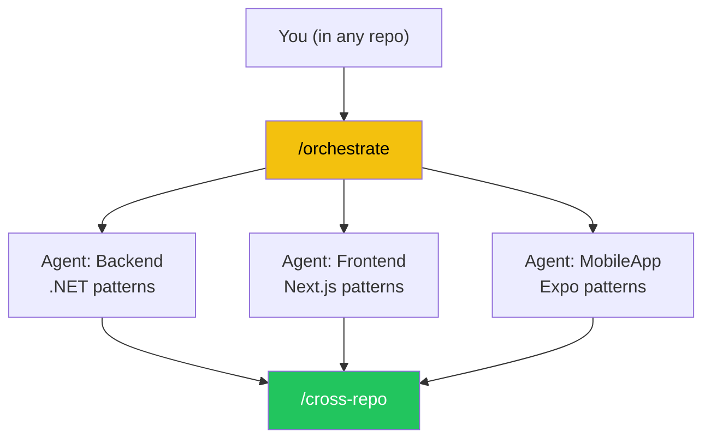
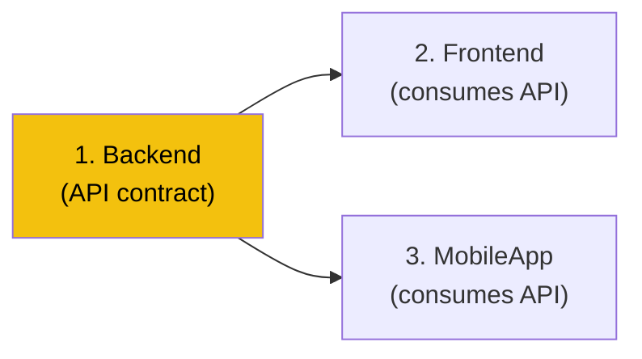

# Cross-Repo Orchestration

> How to work across Backend, Frontend, and MobileApp simultaneously from any repo.

## How It Works

All 3 GODO repos live on the same machine:

| Repo | Local Path |
|------|-----------|
| Backend | `C:/InFiNetCode/Projects/GODO/BACKEND/Backend` |
| Frontend | `C:/InFiNetCode/Projects/GODO/FORM/Frontend` |
| MobileApp | `C:/InFiNetCode/Projects/GODO/APP/MobileApp` |

Claude uses the **Agent tool** to spawn sub-agents that work in each repo directory with its own `CLAUDE.md` context. This means:
- Each repo's patterns and conventions are respected
- Claude generates .NET code for Backend, React for Frontend, React Native for MobileApp
- Each repo's tests/linters are run independently



## When to Use `/orchestrate`

Any task that touches more than one repo:

- **Adding a new API endpoint** → Backend (create endpoint) + Frontend/MobileApp (consume it)
- **Changing a DTO** → Backend (modify DTO) + Frontend/MobileApp (update types)
- **Adding a category** → Backend (seed data) + Frontend (content text) + MobileApp (constants)
- **Adding a tag** → Backend (seed + migration) + Frontend (filter UI) + MobileApp (filter context)
- **Renaming a field** → All repos need to stay in sync

## Walkthrough: Adding a New Subcategory

```
/orchestrate add "Water Sports" subcategory under Sports (category 2, code 204)
```

### What Claude Does

**Step 1 — Analysis:**
```
Analyzing cross-repo impact...

Affected repos: All 3
Order: Backend first (source of truth) → Frontend → MobileApp

## Orchestration Plan

### Backend (source of truth)
- Add subcategory to DataSeeder.cs (code: 204, category: 2)
- Add Swedish name "Vattensport"
- Create migration for seed data
- Update .claude/reference/categories.md

### Frontend
- Add "Water Sports" / "Vattensport" to contentText.tsx
- Map subcategory 204 under category 2

### MobileApp
- Add to filter options / category mappings
- Add Swedish translation

### Verify
- Run /cross-repo to confirm alignment
```

**Step 2 — Backend execution:**
Claude works in the Backend directory, following .NET patterns:
```
→ Editing Infrastructure/Data/DataSeeder.cs
→ Adding: new Subcategory { Code = 204, Name = "Water Sports", NameSv = "Vattensport", ... }
→ Running: dotnet ef migrations add AddWaterSportsSubcategory
→ Running: dotnet test --filter "Subcategory"
```

**Step 3 — Frontend execution:**
Claude spawns an agent in the Frontend directory, following Next.js patterns:
```
→ Editing src/lib/contentText.tsx
→ Adding Water Sports to subcategory mappings
```

**Step 4 — MobileApp execution:**
Claude spawns an agent in the MobileApp directory, following Expo patterns:
```
→ Updating category/subcategory constants
→ Adding translation keys
```

**Step 5 — Verification:**
```
/cross-repo

## Cross-Repo Consistency

### Categories
- [x] Backend DataSeeder: 8 categories, 25 subcategories
- [x] Frontend contentText: 8 categories, 25 subcategories
- [x] MobileApp constants: 8 categories, 25 subcategories

All repos aligned. ✓
```

## Execution Order

Claude follows this default order for cross-repo work:



**Why Backend first?** Backend defines the API contract (DTOs, endpoints, response shapes). Frontend and MobileApp consume these contracts. Changing the producer first ensures consumers have a stable target.

**Exception:** For UI-only changes (styling, translations that don't touch APIs), order doesn't matter.

## Checking Consistency with `/cross-repo`

Run this anytime to verify all 3 repos are in sync:

```
/cross-repo
```

**What it checks:**

| Check | Description |
|-------|-------------|
| Categories | 8 categories match across Backend seed data, Frontend content, MobileApp constants |
| Subcategories | 24+ subcategories match with correct codes and parent mappings |
| Tags | 6 tags match across all repos |
| API types | Frontend/MobileApp TypeScript types match Backend DTOs |
| Endpoints | Frontend/MobileApp API calls use correct Backend route URLs |

**Example mismatch:**
```
### Categories
- [x] Backend: 8 categories, 25 subcategories
- [!] Frontend: 8 categories, 24 subcategories
  → Missing: 204 "Water Sports" — last added to Backend
- [x] MobileApp: 8 categories, 25 subcategories

1 mismatch found. Run /orchestrate to fix.
```

## Combining with Planning

For large cross-repo features, combine `/plan` with `/orchestrate`:

```
/plan add event favorites system
```

Claude might create:
```
Phase 1: Backend — Favorites domain model + API endpoints
Phase 2: Backend — Unit + integration tests
Phase 3: MobileApp — Favorites UI + API integration
Phase 4: Frontend — Favourites in organiser dashboard (optional)
```

Then during Phase 3, Claude uses the orchestration pattern to work in the MobileApp repo while keeping Backend context.

## Important Notes

### Each Repo Has Its Own Branch
Cross-repo work creates changes in each repo independently. You'll need to:
1. Commit in each repo separately
2. Create PRs for each repo
3. Merge Backend PR first (API changes), then Frontend/MobileApp PRs

### Context Usage
Orchestration uses more context than single-repo work because Claude needs to manage multiple codebases. If context gets high (> 60%), consider:
- Running `/orchestrate` for the most critical repo first
- Using `/pause`, then doing remaining repos in a new session

### You Can Run From Any Repo
`/orchestrate` works from Backend, Frontend, or MobileApp. Claude knows the paths to all repos regardless of where you started.

---

**Next:** [Example Workflows →](06-EXAMPLE-WORKFLOWS.md)
